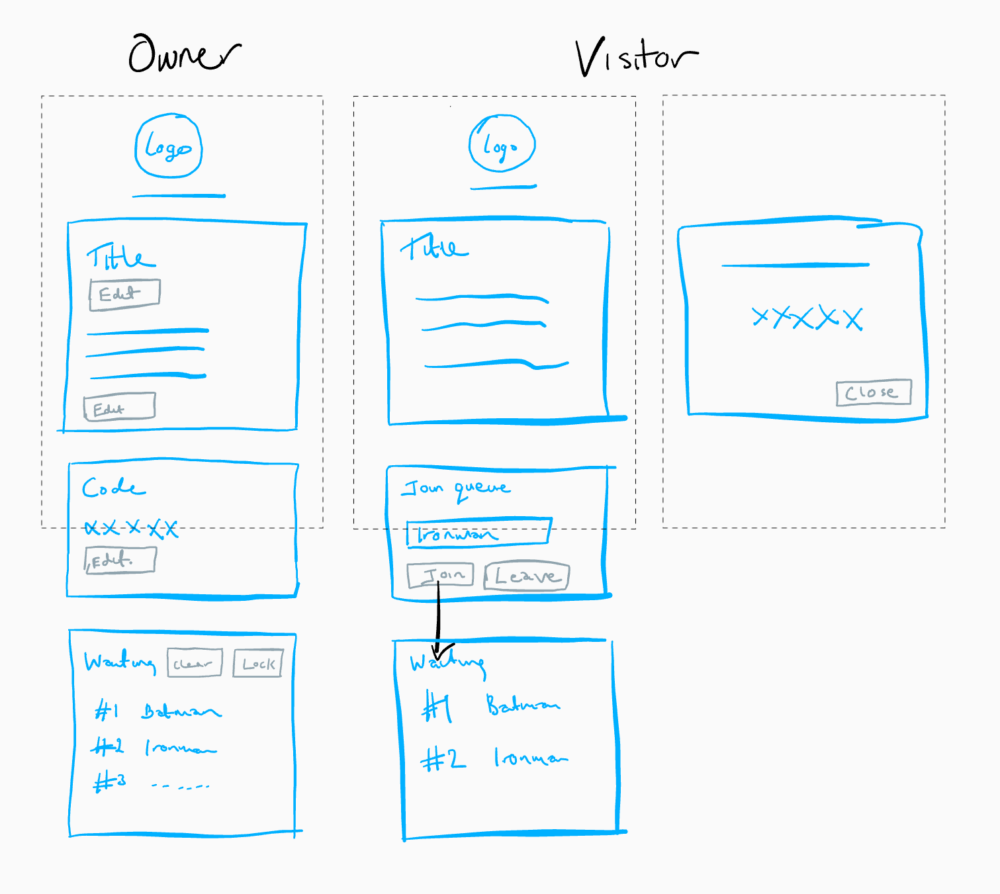

> AC Visitor Center is a queue manager using ReactJS and Firebase created to solve a problem I had in a video game. It allows for a secret code to be securely exposed to the first person in a queue.

In this post I'm going to describe a small side project I worked on AC Visitor Center. The idea for this little side project came from playing a video game, I won't mention the game here but it involves islands, turnips, and traders. I will talk about the UI/UX design and the features of Google's Firebase platform that I used which include hosting, real-time database, Firestore database, and analytics. I'll also talk about some interesting problems I had to solve along the way.

## Mechanics

Your island in the video game has a shop where turnips can be sold at a different price each day, excluding Sundays when you can only buy turnips. Owners of an island can allow remote players to visit their island using a secret code where they can then sell their turnips. Each island has a limit of 8 live connections from visitors which means a total of 9 people on an island, 8 visitors and the owner.

As visitors arrive and leave the island there is a delay of ~60 seconds each time to watch a cut scene of their arrival progress. This can become very frustrating for players when there are a lot of visitors trying to arrive and leave the island constantly. Even with a limit of 8 visitors this means a lot of delay for all players involved.

How can we reduce this delay caused by cut scenes so that we can get on with selling our turnips!?

## Queues


[Photo by Florencia Viadana](https://unsplash.com/photos/mixpzw_FlcA)

Using a queue gives the owner the power to limit the number of people on their island, and also to control the number of visitors arriving. Reducing the number of interruptions from visitors arriving and leaving improves the gameplay experience for all players involved. There are some other issues with this video game mechanic that cannot be solved with a simple queue, but I won't go into those.

The type of queue we need to use here is a FIFO (First In First Out) queue, if I joined the queue first I'll be the first to get my ice-cream.

## Planning

The web application will function similar to a visitor center, a place for people to arrive and relax while they wait to visit an island. The visitor center has two types of users, the **owner** of the visitor center, and the **visitor** trying to get to the island. Each user type has different requirements of the visitor center and the waiting queue inside.

The visitor center must be running in a browser to operate correctly, by fetching real-time data for status updates. It also has a status of open or closed to signify when the owner is online or offline. The waiting queue may be locked or unlocked by the owner to control the flow of visitors. And the visitor center must also provide a code so that users can successfully create a connection to visit an island.

Each user type has different requirements of the visitor center, some of which are listed below as user stories.

As a **visitor**:

- I want to know more about the island before I join the queue so that I'm not wasting my time (required)
- I want to join the queue so that I can get the secret code (required)
- I want to get the latest code when it is updated so that I can visit the island successfully (required)
- I want to leave the queue so that other visitors can get the secret code more quickly (nice to have)

As an **owner**:

- I want to provide information to users about the island so that they don't waste their time waiting in the queue (required)
- I want to remove the first visitor in the queue so that the next visitor can get the secret code (required)
- I want to remove all visitors in the queue so that the waiting list can be cleared (required)
- I want to lock the queue so that visitors can't join the queue unless I allow it (required)
- I want to display the secret code to only the first visitor in the queue so that I can control who connects to my island to visit (required)
- I want to send a message to users in the queue so that I can update them with useful information (nice to have)

## Design

Using the user stories outlined above I roughly sketched the UI for each user type. The dotted line is the mobile devices visible screen area. On the left is what the owner of the visitor center will see. On the right is what the visitor will see, on the far right is the dialog popup that displays the secret code.


_Sketches of the visitor center mobile UI design for both user types owner and visitor._

On the left is the owners view. Owners can edit the title and summary of the visitor center. They can also edit the secret code that will be displayed to visitors in a popup dialog. The waiting list is also immediately displayed for owners which provides functionality to clear the entire list, or lock it to prevent more visitors joining.

On the right is the visitors view. The title and summary of the visitor center is visible at the top of the page, but not editable. Below this is an input for the visitor's username in order to join the queue. They can also leave the queue if they no longer want to wait. Once a user has joined the queue the waiting list is displayed which will update in real-time. When a visitor is first in the queue a dialog popup will be displayed with the secret code. The user can dismiss this dialog by clicking the close button.

Not shown here is the UI design of the messaging feature listed in the user stories. The initial version of the project does not have this feature, I'll wait until I'm asked by enough users to add it before reviewing.

## Implementation

Implementing this project was surprisingly challenging. At first it seemed very straight forward using ReactJS and Google Firebase but as the project progressed there were a few considerations that forced me to make some design changes along the way. I'll cover some of the more interesting problems and solutions of the project here.

### Database read requests

After releasing the project to beta users to get feedback and weed out some of the bugs I noticed something interesting in the Firebase analytics dashboard. The number of read requests being made to the Firestore database was growing very quickly for the number of currently active users. Each read request is charged in Firebase so it was worth investigating.

Listeners are used to watch for real-time changes to the queue data stored in Firestore, the waiting list in the UI sketches above uses this queue data. For the queue to operate correctly the client application needs to be open in both the owner and visitors browser. When a visitor joins or leaves the queue all users will see the updated queue. With Firebase each change to the data being listened to in a Firestore database causes a new read request, websockets are used to provide these real-time updates.


_Firestore database read requests, days along the X axis, number of read requests on the Y axis._

The first iteration of the project allowed all users that opened the app to see the queue. This meant that every instance of the client application loaded in a browser would result in firstly a read to get the full list of visitors currently waiting and then a read each time the queue was updated in some way. This meant a huge number of read requests per user as the queue was being updated in real-time. You can see on days 1 to 3 the number of requests is increasing rapidly.

To fix this issue, on day 3 I updated the design so that the waiting list was only visible to visitors when they joined the queue, owners would still see the queue at all times, and visitors that were not in the queue would not see the queue which meant no real-time updates.

This small change resulted in a remarkable reduction in read requests with minimal impact to the user experience. Instead of seeing the full waiting list, a visitor would only see the number of people waiting in the queue at that time, a snapshot, which only required a single read. Notice on days 4 and 5 the number of read requests changes to a linear trend.

### Keeping the secret code secret

When visitors join the queue they must wait until they are at the front of the queue to receive the secret code. This code is used to connect to the owner's island. It is important that only the visitor in 1st position of the queue can see the code. If anyone else in the queue could see the code the queue would be redundant, so we must keep it secret.

The data for this web application is stored in Firestore database which controls access to data using security rules. Firestore is a NoSQL database which means data is stored in documents which are similar to JSON objects with attributes and links to other objects. Data is structured as a tree and for this project there are two main roots.

- users/{userId}
- centers/{centerId}

There are many rules used to secure the data for this project, I will only talk about the rules used to secure the secret code here. I won't talk about the other rules for securing data in `centers/`, they are mostly for data validation.

```meta
match /users/{userId}
    ...
    allow get: if request.auth != null &&
        (request.auth.uid == userId ||
        request.auth.uid == resource.data.next);
    ...

    allow update: if request.auth != null &&
        (request.auth.uid == userId &&
        request.resource.data.keys().hasOnly(['secret', 'next'])
        ...
```

_Example rules to check user authentication and to secure the secret code._

All users are authenticated anonymously when they open the application in their browser using Firebase authentication. To prevent public access to the data the authentication status for every incoming request is checked.

You can see from the code snippet above that I'm also checking if the request is coming from the owner of the data, or from a user with an Id matching the value stored in `data.next`. This is the main mechanism for allowing access to the secret code.

If we have restricted access to the secret code to only the owner and the user Id stored in `data.next`, then the only other thing to secure is updating this data. With the above rules we restrict updating the data to only the owner of the data, and it must have the correct format.

The rules shown above will secure reading the secret code and updating what user is allowed to read the code. This helps to keep the secret code secret.

### User presence

The visitor center will only operate correctly when the owner has the web application running in their browser. Data is updated in real-time as visitors join and leave the waiting queue. Users need to know if the visitor center is actively running before they join the queue, or they will be waiting until the owner comes back online for the queue to be updated.

```javascript
firebase
  .database()
  .ref('.info/connected')
  .on('value', (snapshot) => {
    if (snapshot.val() === false) {
      return
    }

    userStatusDatabaseRef
      .onDisconnect()
      .set(isOfflineData)
      .then(() => {
        userStatusDatabaseRef.set(isOnlineData)
      })
      .catch((error) => {
        // error occurred updating real-time database
      })
  })
```

_Listen for changes in the users online status and update the database accordingly_

Keeping track of when a user is online or offline is known as user presence, we can do this using the Firebase real-time database. The Firestore database does not provide this feature right now, maybe it will in the future. We use the online/offline status of the owner of the visitor center to let other users know if the visitor center is open or closed.

## Conclusion

In this post I talked about a side project I recently worked on, AC Visitor Center. The tech stack used during implementation was ReactJS, Material UI, and the Google Firebase platform. I gave a quick overview of the planning and design I did before starting. I also discussed some interesting problems and solutions I had to solve during implementation.

This little project only took a few days to design and build. It was fun learning more about Google's Firebase platform and I'm a big fan of learning through doing. Working on this project has thought me to be more conscious of my design choices especially when using real-time data. Another thing I loved about this project was getting feedback as soon as possible using analytics and getting it in the hands of users.

If you made it this far thank you for reading. I encourage you to [build useless things](https://www.ted.com/talks/simone_giertz_why_you_should_make_useless_things?language=en) you never know what you'll learn and re-enforcing the fundamentals is never a bad idea.

## References

- [AC Visitor Center](https://github.com/uxdxdev/acvisitorcenter)
- [Firebase](https://firebase.google.com/)
- [ReactJS](https://reactjs.org/)
- [Material UI](https://material-ui.com/)
- [Create React App](https://create-react-app.dev/docs/getting-started/)
