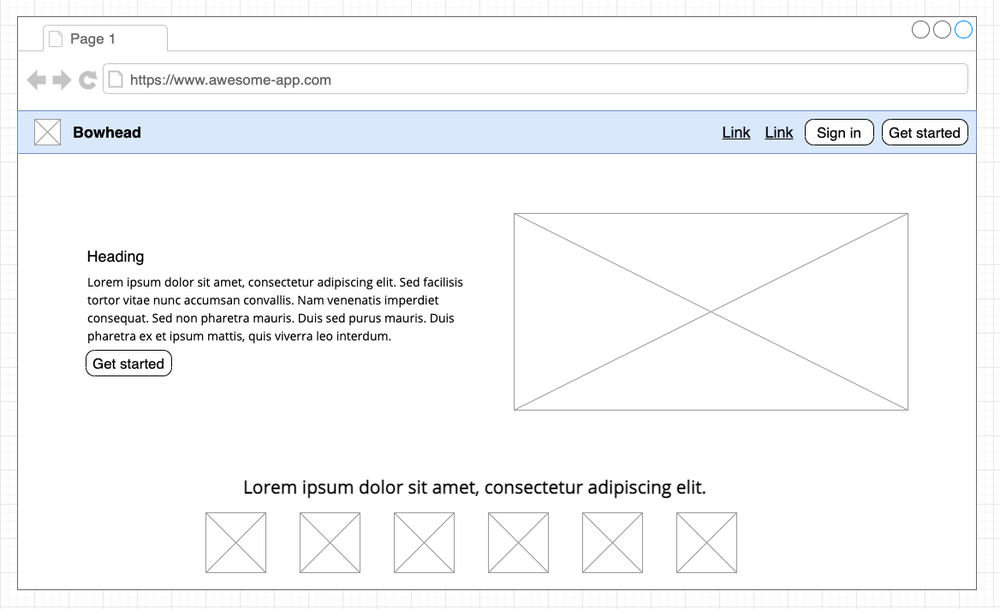
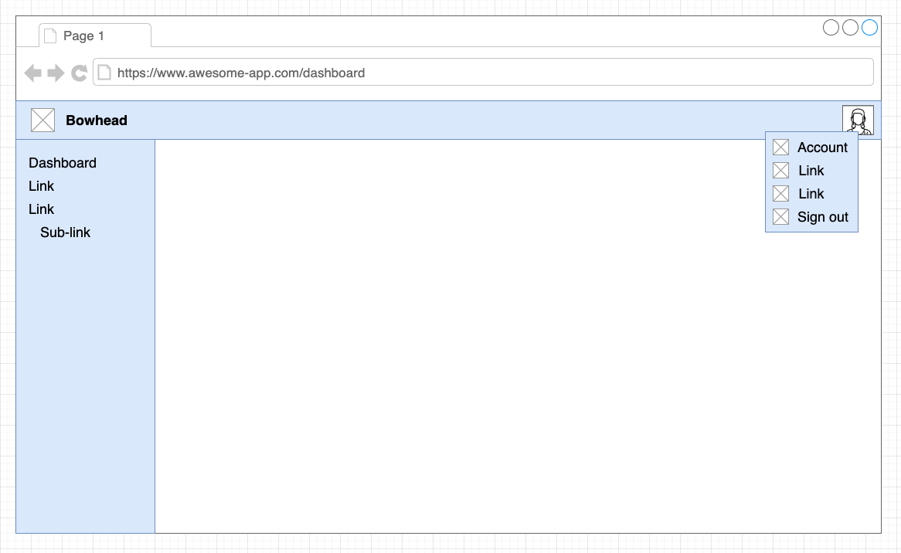
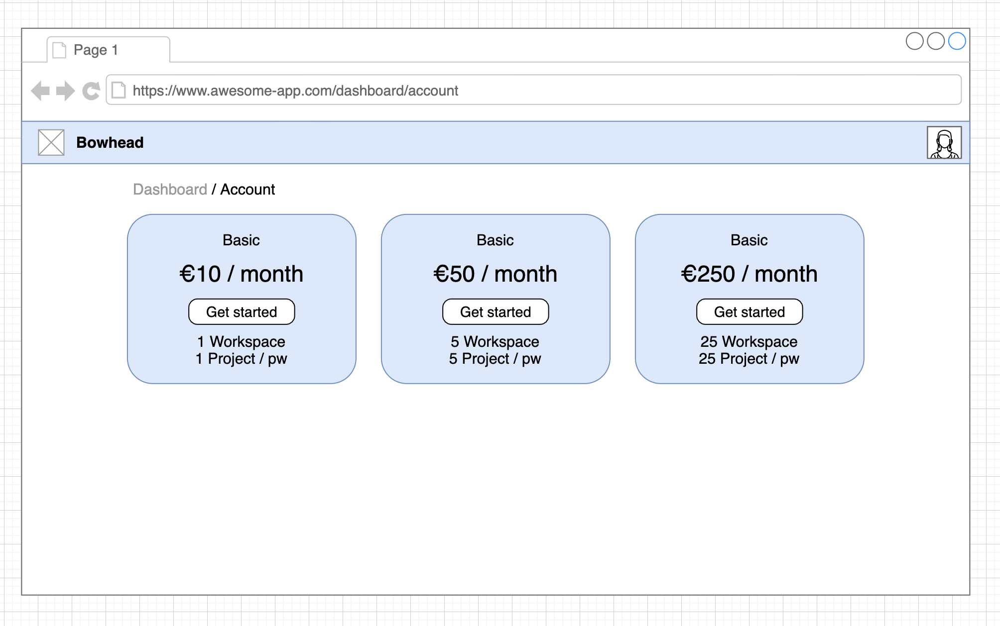
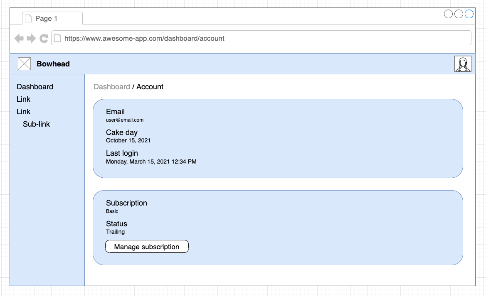
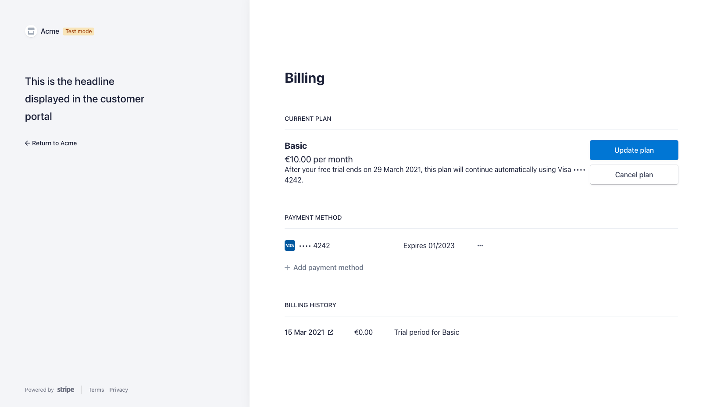

> Bowhead is a boilerplate project for fast micro-saas prototyping using Google's Firebase platform for authentication and data storage, ReactJS for UI, and Stripe for subscription payment processing.

<!-- end -->

What is a Micro-Saas? 

> "A SaaS business targeting a niche market, run by one person or a very small team, with small costs, a narrow focus, a small but dedicated user base and no outside funding. Hence, micro-SaaS." - Tylar Tringas

I've built numerous Saas products keeping to the ideas behind Micro-Saas. Some I started and never finished and some I launched but they failed to gain any traction. Through these experiments I've learned a little about marketing, customer success, design, project planning, product delivery, business management, and persistence. I have yet to build a product that is "successful" but it's only a matter of time.

For each of these MVEs (Minimum Viable Experiments) I've found myself implementing some key features over and over again, such as user authentication, database integrations, payment processing, landing pages, account pages, and dashboards. Bowhead is an attempt to solve this problem.

In this article I'll talk about some of the interesting challenges I encountered while building Bowhead, and some lessons I've learned along the way.

## Bowhead

Naming things is hard, I like whales, so this project was named Bowhead.

> The bowhead whale is a species of baleen whale belonging to the family Balaenidae and the only living representative of the genus Balaena. It is the only baleen whale endemic to the Arctic and subarctic waters.

Bowhead is a project to make the initial setup of a Micro-Saas product a little easier by providing a scaffold of ReactJS components along with a CRA (Create React App)  template. This will allow developers to focus on the business logic of their new product instead of spending time on infrastructure features such user authentication, data storage, and payment processing.

## Planning

The original "big picture" plan for Bowhead was to create a platform for developers to build upon, similar to Shopify, but for Micro-Saas products. This platform would integrate with other third party services to provide the following features:
- User authentication
- Data storage and security
- Payment processing
- Landing pages, Dashboard page, Accounts page
- Authenticated routes
- Hosting
- Continuous Integration/Continuous Deployment

Developers would be able to use a cloud based development environment similar to Codesandbox.io to create ReactJS components to build out their product features protected behind their authenticated routes. These components would be consumed by Bowhead through a plugin system. 

Subscription payments would be handled by the platform and distributed to owners of the Saas products. Hosting of landing pages and all product assets would be managed, the developer would only need to worry about their business logic, branding, and marketing.

I quickly realised that this project would not be achievable in a reasonable amount of time, and was just not the right solution to the problem. So I was ruthless in stripping this down to it's fundamental parts and ended up with a set of more achievable but very different objectives.

### Revised plan

The revised plan is alot less complex than the original but still provides value to developers looking to build their next Micro-Saas product. Below is a list of user stories to describe what a developer might want:

As a **developer**:

- I want user authentication so that my users information is protected (required)
- I want a landing page so that I can communicate my products value to potential customers (required)
- I want a dashboard page so that my users will have a central location to work from (required)
- I want payment processing so that I can generate revenue through subscription payments from users (required)
- I want data storage and security so that my users data is securely stored for processing (required)
- I want a development environment pre-configured so that I don't need to spend time setting one up (required)
- I want to only work on my products business logic so that I can provide value immediately (required)
- I want pre-configured hosting so that I don't need to spend time choosing and setting up a hosting solution (nice to have)
- I want a CI/CD pipeline set up so that I don't need to spend time choosing and setting up CI/CD solution (nice to have)


## Implementation

Based on the above user stories a bunch of solutions came to mind: 

- A Create React App template that scaffolds some of these features together would give developers a ready made development environment that would require very little configuration to get up and running. 

- User authentication, data storage, and security could be handled by Google's Firebase platform. 

- Payment processing can be managed by Stripe's subscription services. 

- A plugin system would enable developers to only work on their products business logic using ReactJS components and inject them into the UI. 

- Developers only need to create the required accounts on Google Firebase, Stripe, Netlify, etc, in order to get access tokens and API keys. These can be passed to Bowhead as configuration data.

- Providing a pre-built landing page, dashboard page, and account page with the ability to inject new components into these as required would speed up development.

The most obvious solution to abstract all of these features away from developers is to use node modules hosted on NPM, and the Create React App template that would have these pre-configured for installation. These are the core node modules:

- bowhead (required)
- bowhead-functions (required)
- eslint-config (code linting, not required)
- cra-template-bowhead (pre-configured development environment, not required)

The required modules here are `bowhead` and `bowhead-functions`. The CRA template is optional and would depend upon and use these modules in a pre-configured development environment. Developers do not have to use the CRA template to get value from this project, they can use their own development environments with the help of some documentation to configure only the required modules.

### NPM modules

- `bowhead` (required)

The **bowhead** package contains the core building blocks of this project. It provides a single ReactJS component `<Bowhead />` that developers can import and render in their application.

```javascript
import { Bowhead } from "@mortond/bowhead";

const App = () => {

  return (
    <Bowhead />
  );
};
```

This component provides the landing page, dashboard page, styling infrastructure, user authentication, Firebase database integrations, Stripe integration, and some other features like dashboard side navigation, and user subscription billing management. All of these features require some configuration information that the user will need to provide.

- `bowhead-functions` (required)

The **bowhead-functions** module contains logic that must be integrated into a backend API for securely managing things like Stripe subscription data and user profile information.

```javascript
    async webhookStripe({ stripeSignature, rawBody }) {

        let verifiedEvent;
        try {
            verifiedEvent = this._stripe.webhooks.constructEvent(rawBody, stripeSignature, this._stripeWebhookSigningSecret);
        } catch (error) {
            // invalid event            
            return Promise.reject(error.message)
        }

        switch (verifiedEvent.type) {
            case 'customer.subscription.created':
                await dbUpdateSubscriptionByCustomerId(this._firestore, verifiedEvent.data.object)
                break;
            case 'customer.subscription.updated':
                await dbUpdateSubscriptionByCustomerId(this._firestore, verifiedEvent.data.object)
                break;
            case 'customer.subscription.deleted':
                await dbUpdateSubscriptionByCustomerId(this._firestore, verifiedEvent.data.object)
                break;
            case 'checkout.session.completed':
                await dbUpdateCustomerData(this._firestore, verifiedEvent.data.object)
                break;
            default:
                // unexpected event type
                return Promise.resolve('unexpected event type');
        }

        return Promise.resolve('webhook done');
    }

    async deleteStripeCustomer({ token, data }) {
        const user = await this._firebase.verifyToken(token);
        const stripeCustomerId = data?.stripeCustomerId;
        // todo validate data
        if (!user) return this._requestUnauthourised()
        return await this._stripe.customers.del(stripeCustomerId);
    }

    async createStripeCustomerPortalSession({ token, data }) {
        const user = await this._firebase.verifyToken(token);
        // todo validate data
        if (!user) return this._requestUnauthourised()
        return await this._stripe.billingPortal.sessions.create(data).then((session) => session);
    }

    async createStripeCheckoutSession({ token, data }) {
        const user = await this._firebase.verifyToken(token);
        // todo validate data
        if (!user) return this._requestUnauthourised()

        // do not provide a free trial if the user has previously signed up
        data?.customer && delete data?.subscription_data;

        return await this._stripe.checkout.sessions.create(data).then((session) => session)
    }
```

Connecting to the Stripe API and Firestore storage must be done through a secure private backend service. This could be a collection of server-less functions, or a NodeJS API that is created by the developer. This backend API must then hook into each of the 4 functions listed above available from the `bowhead-functions` module. Once this backend API is deployed Bowhead must be configured with the deployed URL endpoints for each.

- `eslint-config`

This is a shared configuration used during development, not really important.

- `cra-template-bowhead`

This is the CRA template project which can be a starting point for developers to learn how to use Bowhead and configure it correctly.
### Landing Page

There are a few main pages in every Saas product, the landing page, the dashboard page, the users profile page, and a billing page. The landing page is straight forward and a developer could provide a single ReactJS component with all of the content of this page which Bowhead then renders. Bowhead wraps this landing page content in a navigation bar which has two buttons by default, the `Sign in` and `Get started` buttons.

A developer can then configure the applications name, which is `Bowhead` in this example, and any additional elements that should be in the navigation bar such as anchor links to sections of the page, e.g. links to `#products` or `#services`. 

Here is a mock up of an expected landing page.


*Bowhead landing page mock up*

The navigation bar of the landing page is provided by Bowhead and the contents of this page are injected by the developer using the plugin system.

```javascript
const routesAndMenuItems = [
    // unauthenticated routes are available outside the
    // dashboard routes
    {
      type: PLUGIN_TYPES.ROUTE_UNAUTHENTICATED,
      name: 'route-landing-page',
      path: '/',
      component: LandingPage,
    },
    ...
]

routesAndMenuItems.forEach(plugin => {
  pluginRegistry.register(plugin.name, plugin)
})
```

We use the plugin system to register a landing page component to render at the URL `/` as an unauthenticated route.
### Dashboard page

Once a user has authenticated they are re-directed to the dashboard page. The dashboard page is a UI shell that provides a navigation bar with access to the users account through an avatar dropdown menu. It also provides a side navigation with a link back to the dashboard page. Both the avatar dropdown menu and the side navigation can be customised to include links to custom pages that developers will create and register using the plugin system.


*Bowhead dashboard page mock-up*

The white space in the image above is where developers will inject their business logic, and the links in the side navigation allow for new pages to be added with complex workflows.

```javascript
const routesAndMenuItems = [    
    // authenticated routes are available at /dashboard/*
    {
      type: PLUGIN_TYPES.ROUTE_AUTHENTICATED,
      name: 'route-dashboard-root',
      path: '/',
      component: DashboardRoot,
    },
    {
      type: PLUGIN_TYPES.ROUTE_AUTHENTICATED,
      name: 'route-projects',
      path: '/projects',
      component: Projects,
    },
    ...
    // menu items should be registered before the Bowhead
    // shell is rendered because when the Bowhead nav bar 
    // and sidebar are mounted the plugin registry is checked
    {
      type: PLUGIN_TYPES.LINK_SIDEBAR,
      name: 'menu-item-projects',
      menuIcon: ListIcon,
      text: "Projects",
      path: "/projects",
    },
    ...
  ]

  routesAndMenuItems.forEach(plugin => {
    pluginRegistry.register(plugin.name, plugin)
  })
```

Using the plugin system developers can inject a dashboard root page to customise the main `/dashboard/` page. They can also add new links and pages to the dashboard page to provide workflows and other business logic. In the example above a `Projects` ReactJS component is registered under an authenticated route `/projects`. A link to this route is also added to the side navigation.


### Plugin system

The plugin system is a fundamental feature of Bowhead allowing developers to inject their custom components into certain parts of the default pages. The custom components can integrate with other third party services to provide business value to users and then can be rendered within the dashboard UI shell of Bowhead. 

```javascript
const PLUGIN_TYPES = {
    ROUTE_UNAUTHENTICATED: 'plugin-type-route-unauthenticated',
    ROUTE_AUTHENTICATED: 'plugin-type-route-authenticated',
    LINK_POPOVER: 'plugin-type-link-popover',
    LINK_SIDEBAR: 'plugin-type-link-sidebar',
    LINK_LANDING_PAGE_NAV: 'plugin-type-link-landing-page',
    REDUCER: 'plugin-type-reducer',
    THEME: 'plugin-type-theme',
    LISTENER_FIRESTORE: 'plugin-type-listener-firestore',
    CONFIGURATION_BOWHEAD: 'plugin-type-configuration-bowhead',
};
```
*Plugin types available in Bowhead*

Bowhead is a shell that allows developers to inject their ReactJS components and custom business logic through plugins. These are some of the plugin types that are supported. 

Components can be rendered at authenticated or unauthenticated routes, links can be added to the avatar popover menu or side navigation, custom Redux reducers can be merged with the Bowhead reducers for state management, themes can be registered to change the styling and branding of the product, and other Bowhead specific configuration details can be delivered through this plugin system.

### Subscription Payment Processing

Bowhead uses the Stripe API to manage user subscriptions. There are two parts to this feature, signing up for an initial subscription, and managing that subscription.

#### Pricing page


*Bowhead pricing page mock up*

When a user is not currently signed up to any subscription the pricing page is displayed on sign in, a user must be subscribed to gain access to any custom features developers may add. 

A user can click on the `Get started` button of the subscription they want which brings them to a hosted Stripe payments page. Once payment is made securely using Stripe's portal the Bowhead database is updated through a webhook integration implemented in `bowhead-functions` and the UI is updated.
#### Account page


*Bowhead account page mock up*

The account page displays some basic user information and also provides a button for users to manage their subscriptions.


*Stripe subscription management portal*

If a user clicks this `Manage subscription` button they are re-directed to a hosted Stipe customer portal where they can upgrade or cancel their subscription. Any changes here are reflected in updates to the Bowhead database which will update the UI. 

## Challenges

The plugin system I implemented in Bowhead was the most interesting engineering problem I encountered. Bowhead allows users to inject custom ReactJS components into parts of the UI shell, for example the dashboard page and side navigation. 

```javascript
const routesAndMenuItems = [
  {
    type: PLUGIN_TYPES.ROUTE_AUTHENTICATED,
    name: 'route-projects',
    path: '/projects',
    component: Projects,
  },
  ...
  ]

...

routesAndMenuItems.forEach(plugin => {
    pluginRegistry.register(plugin.name, plugin)
  })
```
Users register their custom ReactJS components in there projects source code, e.g. `App.js`. In this case a `Projects` component is being injected with the route `/projects`. This will render at `/dashboard/projects` when the user is authenticated. 

```javascript
// bowhead.js
const authenticatedRoutes = pluginRegistry.getPluginsByType(PLUGIN_TYPES.ROUTE_AUTHENTICATED)

...

const DashboardWrapper = (props) => {
    return (
      <Dashboard {...props} >
        {getRoutes({ routes: authenticatedRoutes, isAuthRoute: true })}
      </Dashboard>)
  }

...
    <BrowserRouter>
      <Switch>
        {getRoutes({ routes: unAuthenticatedRoutes })}
        <Route path="/signin" component={SignIn} />
        <Route path="/verify" component={Verify} />
        <AuthenticatedRoute path="/dashboard" component={DashboardWrapper} />
        <Route component={() => <div>No page found</div>} />
      </Switch>
    </BrowserRouter>

```
In the Bowhead initialisation phase we grab the unauthenticated and/or authenticated routes and their ReactJS components. Then render those as children of the `Dashboard` component. We are ignoring the other types of components here like links in the side navigation and other customisations for brevity.

```javascript
// <Dashboard />

<Switch>
  {!isSubscribed && <Route exact path={`${match.path}/`} component={Pricing} />}
  {children}
  <Route exact path={`${match.path}/account`} component={Account} />
  <Route component={() => <div>No page found</div>} />
</Switch>
```
Inside our `Dashboard` component we render the children conditionally showing the Pricing page or Account page depending on subscription status or route. So now the developers custom `Projects` component will be rendered on the Bowhead dashboard. 

This so far seems very straight forward, but those custom ReactJS components like `Projects` may want to use shared state, for example Redux. Bowhead will merge any state slices registered by the developer so that this state management is available in custom components.


```javascript
import { pluginRegistry, PLUGIN_TYPES } from '@mortond/bowhead'

const projectSlice = createSlice({
  name: 'project',
  initialState: {},
  reducers: {
    createProject(state) {
      return {
        ...state,
        isCreatingProject: true,
        createProjectError: null,
      };
    },
    createProjectSuccess(state) {
      return {
        ...state,
        isCreatingProject: false,
        createProjectError: null,
      };
    },

    ...
    
  }
})

pluginRegistry.register('project-reducer', {
  type: PLUGIN_TYPES.REDUCER,
  name: 'project',
  reducer: projectSlice.reducer
})

export const {
  createProject,
  createProjectSuccess,
  ...  
} = projectSlice.actions

export default projectSlice.reducer
```
A developer can create a slice of state and register this slice as a `REDUCER` type plugin which will then be integrated into Bowheads state. 

```javascript
// projects.js

const Projects = () => {

  const state = useSelector((state) => state);

  const {    
      project: { isCreatingProject },
      ...
  } = state;

  return (
    ...
  )
}
```
Now in the custom `Projects` component we can access this state.
## Conclusion

This project was fun to work on, but I think a little too complex for developers to get real value from. In order to get Bowhead up and running you need to configure Google Firebase and Firestore, Stripe, some backend APIs or server-less functions, and finally hosting for the application. 

Each of these tasks may be complex in themselves. I consider Bowhead an experiment and **I don't recommend developers use it in their products**. Integrations to third party services are difficult to maintain and risks are introduced when they are abstracted away into a library that you do not maintain yourself. You are relying on the developers of these abstractions to keep their integrations updated and secure.

I learned some really valuable concepts during this project. UI shells can be useful to speed up productivity. Things like landing pages, navigation bars, dashboard pages, and account pages, are commonly required in a basic Micro-Saas product. Having these as templates to hand for your next product is a good idea. A design system that contains ReactJS component implementations of it's designs would help here too.

I also learned that building products with good DX (Developer eXperience) is difficult and requires alot of thought in relation to design, software architecture, and documentation. Talking to other developers would have helped me immensely while I was working on Bowhead to figure out what features were unnecessary.

There are tons of implementation details I could talk about but too many for this article. If you are interested in the details and want to dig around the code you can check out the project on GitHub [here](https://github.com/daithimorton/bowhead).

## Related

- [What is DX?](/blog/what-is-dev-ux)

## References

- [Bowhead](https://github.com/daithimorton/bowhead)
- [ReactJS](https://reactjs.org/)
- [Create React App](https://create-react-app.dev/)
