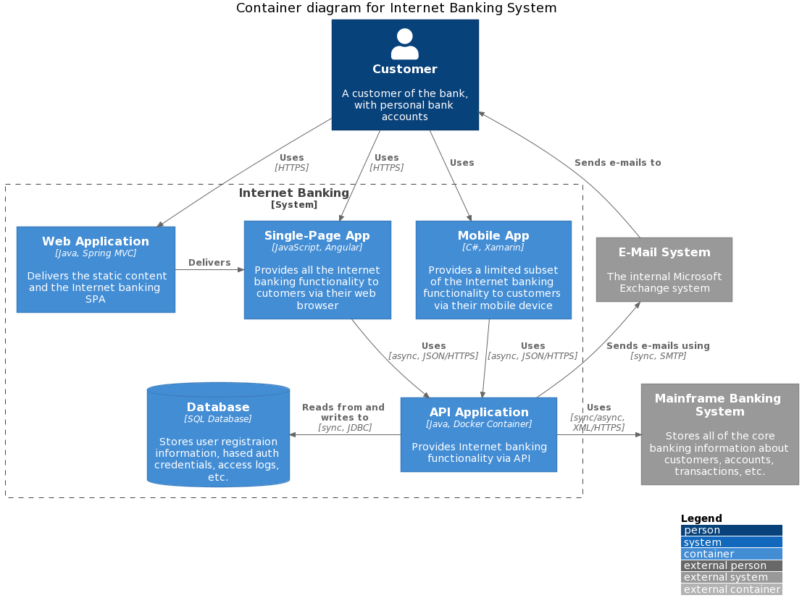

In this post I'm going to talk about the C4 Model for creating software architecture diagrams. I'll mention the setup I use to create them with VSCode and PlantUML. And I'll talk a little about why I prefer the C4 model over UML.

I've tried to learn Unified Modelling Language (UML) a number of times over the years, but each time I attempt to get a grasp on it I get overwhelmed and give up. One reason for this is that there are so many different diagrams and notation to use in specific contexts it can get confusing very quickly. The tooling around creating these diagrams to a high standard for sharing is also difficult to use.

The primary use of a software architecture diagram is for communication. This means that if you use UML to create your diagram, the people you are trying to communicate with must understand UML to some extent. Now remember, you may be trying to communicate some software architectural decisions to stakeholders in business, operations, sales, and development. Most of these people will not understand UML.

## C4 Model

The [C4 model](https://c4model.com/) was created by the software architect Simon Brown between 2006 and 2011 on the roots of Unified Modelling Language (UML) and the 4+1 architectural view model. 

> C4 model is a lean graphical notation technique for modelling the architecture of software systems. It is based on a structural decomposition of a system into containers and components and relies on existing modelling techniques such as the Unified Modelling Language (UML) or Entity Relation Diagrams (ERD) for the more detailed decomposition of the architectural building blocks. - Wikipedia

There are 4 heirarchical levels:

- Context diagrams (Level 1)
- Container diagrams (Level 2)
- Component diagrams (Level 3)
- Code diagrams (Level 4)

There are 5 diagramming elements:

- Persons
- Software Systems
- Containers
- Components
- Relationships

Diagram levels 1 to 3 use the C4 Model elements, level 4 diagrams use existing notations suchs Unified Modelling Language (UML), Entity Relation Diagrams (ERD) or diagrams generated by Integrated Development Environments (IDE).

The C4 Model does not specify layout, shape, color, or style for diagrams or elements, it recommends the use of simple nested boxes. It does however specify the use of diagram titles, legends, and also recommends labels and descriptions on diagramming elements.

### System Context diagram (Level 1)

> System Context diagrams are of systems that deliver value to its users, human or machine. They are the highest level of abstraction.


### Container diagram (Level 2)

> Containers are seperate deployable units, such as web applications, database, serverless functions, or even a bash script.



### Component diagram (Level 3)

> Components execute inside the same process space, they are interfaces to functionality, and are not seperate deployable units. They might be controller classes in an applications, or a facade to a legacy interface.


### Code diagram (Level 4)

> Do not create Code (Level 4) diagrams. These diagrams should be generated from the code base. These diagrams may not use the C4 Model notation, but in fact may be UML diagrams, such as Class Diagrams.

## Supplementary Diagrams

There are some other diagrams under the C4 model that communicate the software system in different ways.

### System Landscape Diagram

At an Enterprise level many software systems may interact with each other, a System Landscape diagram sits on top of the other C4 model diagrams showing multiple System Context diagrams allowing you to drill down on each one.


### Dynamic Diagram

At an Dynamic diagram is a System Landscape, System Context, or Container diagram that shows communication flow in a system using numbered interactions.


### Deployment Diagram

A Deployment diagram shows how System Context or Containers map to infrastructure. A deployment node is used as a boundary. A node could be:

- a physical server or device
- virutalised infrastruce like a Platform as a Service instance
- a Virtual Private Server
- containerised infrastructure like a Docker container
- an application server like Tomcat or Database server

Deployment nodes can be nested.


### C4 Metamodel

#### Elements and relationships

| Element type    | Parent            | Properties                                                                                                                 |   |   |
|-----------------|-------------------|----------------------------------------------------------------------------------------------------------------------------|---|---|
| Person          | None              | Name*, Description, Location (Internal or External)                                                                          |   |   |
| Software System | None              | Name*, Description, Location (Internal or External), The set of containers that make up the software system                   |   |   |
| Container       | A software system | Name*, Description, Technology, The set of components within the container                                                    |   |   |
| Component       | A container       | Name*, Description, Technology, The set of code elements (e.g. classes, interfaces, etc) that the component is implemented by |   |   |
| Code Element    | A component       | Name*, Description, Fully qualified type                                                                                     |   |   |
| Relationship**  |                   | Description, Technology   

\* All elements in the model must have a name, and that name should be unique within the parent context (tooling may or may not choose to enforce this uniqueness).

** Relationships are permitted between any elements in the model, in either direction.

#### Views

| View type         | Scope              | Permitted elements                                                                                                                            |   |
|-------------------|--------------------|-----------------------------------------------------------------------------------------------------------------------------------------------|---|
| 1. System Context | A software system. | Software systems People |  |
| 2. Container      | A software system  | Software systems People Containers within the software system in scope |  |
| 3. Component      | A container        | Software systems People Other containers within the parent software system of the container in scope Components within the container in scope |  |
| 4. Code           | A component        | Code elements (e.g. classes, interfaces, etc) that are used to implement the component in scope |  |

## PlantUML, C4 Model, and VSCode

PlantUML is a tool for creating diagrams, there is a plugin for C4 Model diagrams, and a VSCode extension for using PlantUML. This setup is the easiest way I've found to create C4 model diagrams.

- Download and run a PlantUML server using docker https://github.com/plantuml/plantuml-server#how-to-run-the-server-with-docker
- Install the PlantUML extension for VSCode https://marketplace.visualstudio.com/items?itemName=jebbs.plantuml
- Update VSCode user settings to tell the PlantUML extension where to find the PlantUML server

```json
{
    "plantuml.server": "http://localhost:8081",
    "plantuml.render": "PlantUMLServer"
}
```
- Learn how to use PlantUML to create diagrams https://github.com/plantuml-stdlib/C4-PlantUML

```plantumlcode
@startuml C4_Elements
!include https://raw.githubusercontent.com/plantuml-stdlib/C4-PlantUML/master/C4_Container.puml

Person(personAlias, "Label", "Optional Description")
Container(containerAlias, "Label", "Technology", "Optional Description")
System(systemAlias, "Label", "Optional Description")

Rel(personAlias, containerAlias, "Label", "Optional Technology")
@enduml
```

- Copy/paste the PlantUML C4 model snippets into .vscode for autocomplete https://raw.githubusercontent.com/plantuml-stdlib/C4-PlantUML/master/.vscode/C4.code-snippets

## Conclusion

I use the C4 model to understand projects, practice my system design skills, and communicate with other people on my team. The setup in VSCode is by far the best experience I've had trying to create software architecture diagrams. Tools like draw(dot)io and Visio are great, but they let me do too much! PlantUML lets me describe what I want to see in the diagram and it generates, and updates, the diagram for me.

I like the C4 model because it presents software systems like a map, I like maps, and know how to use the zoom feature of digital maps to get more detail if needed. You can start at the highest level System Landscape diagram and zoom in to a System Context for more information. If I want more detail I can zoom in again to a Container, and then continue zooming in for more and more detail. In this way I get just the right amount of information and if I want more information I go deeper. 

Another nice thing about the C4 model is that there are contraints on the number, types, and styling of elements you can use for a diagram. At a minimum the diagram should make sense without worrying about layout, shape, color, or style. Simple nested boxes with titles, labels, and descriptions, alongside a diagram title and legend, are enough to fully communicate a specific level of a software system.

## References

- [Unified Modelling Language (Wikipedia)](https://en.wikipedia.org/wiki/Unified_Modeling_Language#:~:text=The%20Unified%20Modeling%20Language%20(UML,the%20design%20of%20a%20system.&text=It%20was%20developed%20at%20Rational,led%20by%20them%20through%201996))
- [C4 Model](https://c4model.com/)
- [C4 PlantUML diagram examples](https://github.com/plantuml-stdlib/C4-PlantUML/blob/master/samples/C4CoreDiagrams.md)

