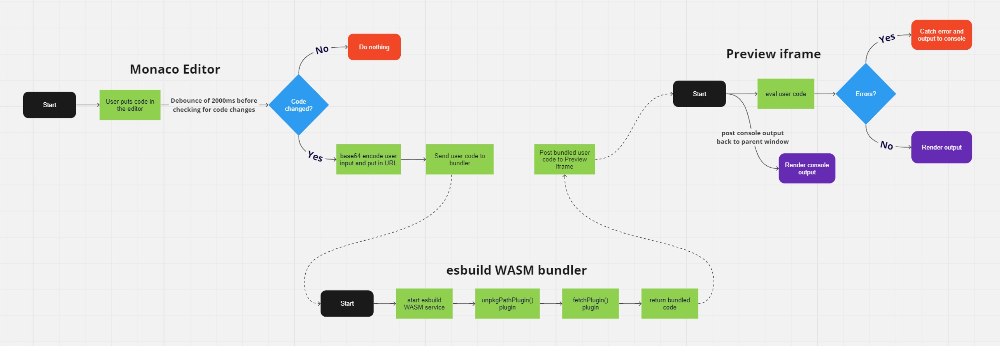
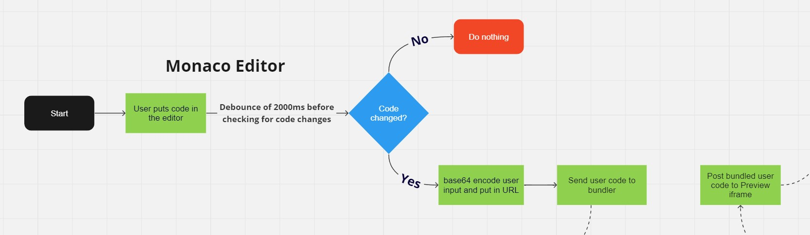
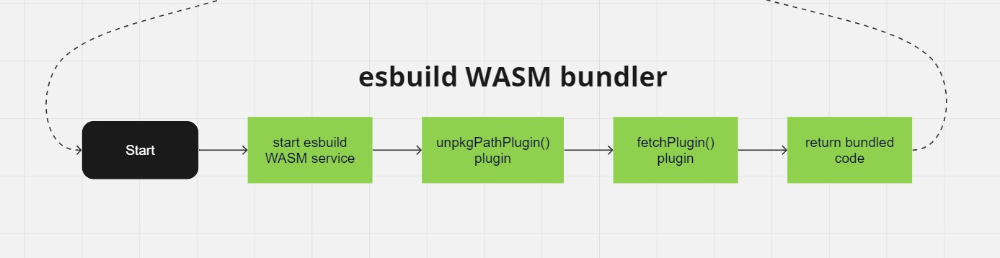
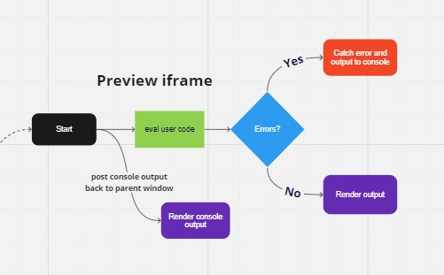

> JSEnv is a simple in-browser JavaScript playground. It automatically downloads dependencies from unpkg.com, it uses the WASM build of esbuild to bundle your code, and renders output to an iframe. Let's talk about how it works.

In this post I'm going to document a deep dive into how the JSEnv project works. We'll talk about the Monaco editors configuration. Then we'll take a look at `esbuild WASM` and the plugins written to fetch code dependencies and resolve modules during the bundling phase. Finally we'll see how the output is rendered in an iframe and console output shown to the user.

JSEnv is deployed as a static site to GitHub pages and can be accessed from the URL https://uxdx.dev/jsenv/. It runs entirely in the browser, downloads code dependencies from unpkg.com, bundles them using esbuild WASM, and posts the results to an iframe for rendering using `eval()`.

## Flowchart




This flowchart shows how user code moves through the system and is rendered in the preview iframe. There are 3 main phases in this project; getting the users code, resolving dependencies and bundling, and rendering the output.

## Monaco editor



Monaco editor is a browser based code editor. I'm using this in it's most basic form to allow users to enter JavaScript code which will then be sent to the bundler automatically after 2000ms of no activity, i.e. debounce. The editors configuration is below.

```tsx
<MonacoEditor
  editorDidMount={onEditorDidMount}
  value={initialValue}
  theme="dark"
  language="javascript"
  height="100%"
  options={{
    wordWrap: "on",
    minimap: { enabled: false },
    showUnused: false,
    folding: false,
    lineNumbersMinChars: 3,
    fontSize: 16,
    scrollBeyondLastLine: false,
    automaticLayout: true,
  }}
/>
```

The `onEditorDidMount` function initialises the editor with hooks for our React state to capture the editor content. It also uses the `monaco-jsx-highlighter` module with the `codeShift` module to highlight JSX syntax in the editor. 

The other options are for basic editor customisations to provide a nice UX for the user while they are writing they're JavaScript.

Monaco editor integration code can be viewed [here on GitHub ](https://github.com/uxdxdev/jsenv/blob/main/src/components/code-editor.tsx)

The editor content is sent to the esbuild WASM bundler so it can be processed to resolve dependencies and finally is sent to the preview iframe for rendering.


## esbuild WASM bundler



```tsx
const bundle = async (rawCode: string) => {
  if (!service) {
    service = await esbuild.startService({
      worker: true,
      wasmURL: 'https://unpkg.com/esbuild-wasm@0.8.27/esbuild.wasm',
    });
  }

  try {
    const result = await service.build({
      entryPoints: ['index.js'],
      bundle: true,
      write: false,
      plugins: [unpkgPathPlugin(), fetchPlugin(rawCode)],
      define: {
        'process.env.NODE_ENV': '"production"',
        global: 'window',
      },
    });

    return {
      code: result.outputFiles[0].text,
      err: '',
    };
  } catch (err: unknown) {
    if (err instanceof Error) {
      return {
        code: '',
        err: err.message,
      };
    }
  }
};
```

### unpkgPathPlugin

```tsx
export const unpkgPathPlugin = () => {
  return {
    name: "unpkg-path-plugin",
    setup(build: esbuild.PluginBuild) {
      // Handle root entry file of 'index.js'
      build.onResolve({ filter: /(^index\.js$)/ }, () => {
        return { path: "index.js", namespace: "a" };
      });

      // Handle relative paths in a module
      build.onResolve({ filter: /^\.+\// }, (args: any) => {
        console.log(args);
        return {
          namespace: "a",
          path: new URL(args.path, "https://unpkg.com" + args.resolveDir + "/").href,
        };
      });

      // Handle main file of a module
      build.onResolve({ filter: /.*/ }, async (args: any) => {
        return {
          namespace: "a",
          path: `https://unpkg.com/${args.path}`,
        };
      });
    },
  };
};
```


### fetchPlugin

```tsx
export const fetchPlugin = (inputCode: string) => {
  return {
    name: 'fetch-plugin',
    setup(build: esbuild.PluginBuild) {
      build.onLoad({ filter: /(^index\.js$)/ }, () => {
        return {
          loader: 'jsx',
          contents: inputCode,
        };
      });

      build.onLoad({ filter: /.*/ }, async (args: any) => {
        const cachedResult = await fileCache.getItem<esbuild.OnLoadResult>(
          args.path
        );

        if (cachedResult) {
          return cachedResult;
        }
      });

      build.onLoad({ filter: /.css$/ }, async (args: any) => {
        const { data, request } = await axios.get(args.path);
        const escaped = data
          .replace(/\n/g, '')
          .replace(/"/g, '\\"')
          .replace(/'/g, "\\'");
        const contents = `
          const style = document.createElement('style');
          style.innerText = '${escaped}';
          document.head.appendChild(style);
        `;

        const result: esbuild.OnLoadResult = {
          loader: 'jsx',
          contents,
          resolveDir: new URL('./', request.responseURL).pathname,
        };
        await fileCache.setItem(args.path, result);

        return result;
      });

      build.onLoad({ filter: /.*/ }, async (args: any) => {
        const { data, request } = await axios.get(args.path);

        const result: esbuild.OnLoadResult = {
          loader: 'jsx',
          contents: data,
          resolveDir: new URL('./', request.responseURL).pathname,
        };
        await fileCache.setItem(args.path, result);

        return result;
      });
    },
  };
};
```

## Preview iframe



```html
<html>
  <head>
    <style>
      html, body, #root{
        margin: 0;
        height: 100%;
      }

      ...
    </style>
    
  </head>
  <body>
    <div id="root">
      <div id="loading-text-container">
        <div class="lds-ripple">
          <div></div>
          <div></div>
        </div>
      </div>
    </div>
    <script>
      const out = (type) => (str) => {            
        window.top.postMessage({ origin: 'preview', type, message: str }, '*');
      }
      window.console = {
          log: out('log'),
          error: out('error'),
          info: out('info'),
          warn: out('warn'),
          clear: out('clear')     
      };

      const handleError = (err) => {
        const root = document.querySelector('#root');
        root.innerHTML = '<div style="color: red;"><h4>Runtime Error</h4>' + err + '</div>';
        console.error(err);
      };

      window.addEventListener('error', (event) => {
        event.preventDefault();
        handleError(event.error);
      });

      window.addEventListener('message', (event) => {
        try {
          eval(event.data);          
        } catch (err) {
          handleError(err);
        }
      }, false);
    </script>
  </body>
</html>
```