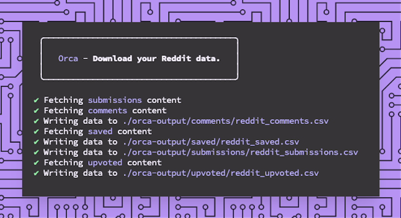

With a Graphical User Interface (GUI) a user can interact with buttons, menus, dropdowns, radio buttons, etc. A Command-Line Interface (CLI) is different in that a user will typically type commands as lines of text into a terminal shell which are then interpreted to perform some action. Some examples of terminal shells are [Z Shell](https://en.wikipedia.org/wiki/Z_shell) or [Bash](<https://en.wikipedia.org/wiki/Bash_(Unix_shell)>), and some examples of CLI tools are [NPM](https://docs.npmjs.com/about-npm) or [Yarn](https://yarnpkg.com/).

## Orca



Orca is a CLI tool I built that lets you download your Reddit data, specifically your upvoted content, saved content, submissions, and comments. I could not find a tool that let me do this and I also wanted to learn more about CLI design which is why I built it.

## Planning

I envisioned Orca being used to frequently grab my Reddit data by only downloading new content that I had saved since the last download. This would run on a local or remote server on a schedule. I could then access this data over the network. To do this Orca would need to know what the last piece of downloaded data was so that it could pick up where it left off on subsequent runs.

I also wanted Orca to download my content from Reddit in the form of a list of links to `.txt` files. I have a bunch of posts "bookmarked" that I want to read at some point and I use the upvoting and save features of Reddit to do this. After some thought I decided that the `.csv` format for the data would be the most useful. This would allow other tools to parse the output, and would also allow users to easily view the data in a spreadsheet tool. Providing other data format options would be a nice to have but not required for the first release.

Aside from these functional requirements I wanted Orca to be extremely easy to use. Unfortunately getting Reddit API tokens requires some manual steps so the most straight forward way I thought to make this a little easier for users was to provide some documentation in the help section of the CLI.

So as a first step I recorded the features I wanted as user stories, and also included some "nice to have" features.

As a **user**:

- I want to download my upvoted content so that I can review it (required)
- I want to download my saved content so that I can review it (required)
- I want to view my data in Excel so that I can review it (required)
- I want to read some documentation that will help me setup the tool (required)
- I want to download only my latest Reddit data so that I'm not downloading all of my data each time I run the tool (required)
- I want to download my comments content so that I can review it (nice to have)
- I want to download my submissions content so that I can review it (nice to have)
- I want to format my data as JSON, txt, or CSV (nice to have)

## Design

Orca interacts with the Reddit API through an NPM package called [snoowrap](https://www.npmjs.com/package/snoowrap). When initialising this package it looks for user authentication credentials. Orca is a CLI tool and so these credentials must be passed as text input on the command line by the user.

For the initial release of Orca I wanted users to provide as little information as possible to get the tool to do it's job. Because Orca uses snoowrap under the hood it means that we can provide a few different ways to initialise the tool very easily.

### Authentication

```javascript
const r = new snoowrap({
  userAgent: 'Orca app',
  clientId: program.clientId,
  clientSecret: program.clientSecret,
  accessToken: program.accessToken,
  refreshToken: program.refreshToken,
})
```

_snoowrap configuration requires user authentication credentials_

Getting the authentication credentials required for the **snoowrap** package is not very straight forward. I wanted this CLI tool to have a good user experience so I provided a list of steps to gather the required authentication credentials in the help section of the CLI. This will be output to the console for the user to read.

### Help documentation

These steps are presented to the user in the **help** section. To see the help section a user must run the command `orca -h`. This feature of a CLI tool is typically used for documentation related to the available options a CLI tool has, and how to use them.

The help section of a CLI tool should supplement a more in depth collection of documentation that provides usage examples to the user. This could be a website used specifically for the Orca documentation but as a first step providing enough information to the user in the help section here should get them started quickly.

```console
Setup steps:
- Open https://www.reddit.com/prefs/apps/
- Click Create app button
- Pick a name, e.g. Orca web app
- Select web app as the application type
- Set redirect url to https://not-an-aardvark.github.io/reddit-oauth-helper/
- Click Create app button
- Copy your client id, e.g.

    Orca
    web app
    FlF8aE_FAKE_gpYa_LNw (client id)

- Copy your client secret, e.g.

    secret z1KNAUb_c0MF7_FAKE_hGyR8lfHCQjnzJtGw

- Open https://not-an-aardvark.github.io/reddit-oauth-helper/
- Input your client id and client secret at the top of the page
- Select scopes
    - history
    - identity
    - read
- Click Generate tokens button and then click Allow
- Copy your access token from the bottom of the page, e.g.

    Access token: 70162531-eWBggyup_FAKE_Usdf1cz7u-G9pM_dhrVf3g

- Run Orca

npx @mortond/orca --access-token=70162531-eWBggyup_FAKE_Usdf1cz7u-G9pM_dhrVf3g
```

_Steps to gather the required authentication credentials of the snoowrap package_

### Usage

Once the user has read the help section documentation and familiarised themselves with how to get the required authentication credentials like their client Id, client secret, and access token, they can then choose what way they want to initialise Orca. I provided two ways to do this:

- Use an access token which will expire after one hour once created. (one time execution)
- Use a client Id, client secret, and refresh token which will remain active until revoked by the user. (scheduled execution)

Users may only want to run Orca once to download their current Reddit data, or they may want to run Orca on a schedule to download their data and any subsequent data that is generated as they use Reddit. Providing options for both was easy to do and will provide value to more users.

### Options

I wanted Orca to have a reasonable default configuration. By default, it will download all data types only once in the CSV format, and It will write this data to a default output directory. Each of these defaults are configurable through a set of options.

- `--data <string>`
  - Data to download, e.g. upvoted,saved,submissions,comments
  - Default: `--data=upvoted, saved, submissions, comments`
- `--output-dir <directory>`
  - Output directory for data files
  - Default: `--output-dir=orca-output`
- `--format <string>`
  - Downloaded data format
  - Default: `--format=csv`
- `--only-latest`
  - Download only the latest data since last execution
  - Default: `--only-latest=false`

Some of these options are required for the snoowrap package to communicate with the Reddit API depending on use case:

**Scheduled execution, multiple runs**

- `--client-id <id>` (required)
  - Reddit application client Id. See https://www.reddit.com/prefs/apps/
- `--client-secret <secret>` (required)
  - Reddit application client secret. See https://www.reddit.com/prefs/apps/
- `--refresh-token <token>` (required)
  - Refresh token generated using https://not-an-aardvark.github.io/reddit-oauth-helper/

**One time execution, token lasts for 24 hours**

- `--access-token <token>` (required)
  - Access token generated using https://not-an-aardvark.github.io/reddit-oauth-helper/

With all of these design decisions made around authentication, data formatting, and output locations Orca can be used simply with the following command:

```console
npx @mortond/orca --access-token=70162531_FAKE_VxvHpXFiB0DCpA
```

_Orca will download the users Reddit data once using it's default configuration_

## Implementation

Based on the user stories documented above for this tool I will describe in this section the more interesting parts of the implementation, you can review all of the code on the GitHub repository [here](https://github.com/uxdxdev/orca).

### Formatting

For the first release of Orca the only data format I planned to implement was the CSV format, but upon implementing this feature it was trivial to add the other formats JSON and txt.

```javascript
const formatCsv = (data) => {
  if (!data || !data.length) return []

  const array = [Object.keys(data[0])].concat(data)
  return array
    .map((item) => {
      return Object.values(item)
        .map((entry) => entry.replace(/\n|\r|,/gm, ' '))
        .toString()
    })
    .join('\n')
}

const formatTxt = (data) => {
  if (!data || !data.length) return []

  let result = ''
  data.forEach((item) => {
    Object.keys(item).forEach((key) => {
      result += `${key}: ${item[key].replace(/\n|\r/gm, ' ')}\n`
    })

    result += `---` + `\n`
  })
  return result
}

const formatJson = (data) => {
  if (!data || !data.length) return []

  return JSON.stringify(data)
}
```

Each of the formatter functions receive the same data structure from the previous step in the promise chain. The output of these formatters is a string that is passed on to the file writer. I like how simple and straight forward this implementation is, it will be easy for me to understand what's happening here If I ever revisit this code. The promise chain reminds me of the chain of responsibility pattern, and the formatter functions resemble the command pattern.

```javascript
  ...
  const promises = []
  const dataTypeDownloaderMap = {
      saved: getSavedContent,
      upvoted: getUpvotedContent,
      submissions: getSubmissionsContent,
      comments: getCommentsContent
  }
  dataToDownload.forEach(dataType => {
      const downloader = dataTypeDownloaderMap[dataType]
      const promise = downloader({ config, onlyLatest })
          .then(saveLatestEntry)
          .then(formatter)
          .then(data => {
              const filename = `reddit_${dataType}`;
              return writeDataToFile({ rootOutputDirectory, dataType, filename, data, format });
          }).catch(error => {
              // do nothing
          })
      promises.push(promise)
  })

  Promise.all(promises).then(() => console.log('\n'))
  ...
```

I've implemented a collection of promises for each data type based on the user's preference using the `--data` option. The steps involved in fetching the user's Reddit data are all chained together using `Promise.then()`, I could have used `async/await` here but by using a promise chain we can fetch different data types concurrently. The formatter functions are run in this chain and configured prior to this based on the user's input to the CLI option `--format` which can be `csv`, `json`, or `txt`.

### Keeping track of the latest data

Orca will download all of the user's Reddit data when it runs by default. A primary use case for this tool is to only download the latest data since the last download so we can run this on a schedule. This means we need to keep track of the last entry in the data each time we run Orca. I've done this using a configuration file `orca.config.js` that is written to the current working directory when Orca runs. This configuration file stores the latest entry id for each data type the user has chosen.

```json
{
  "data": {
    "saved": {
      "latest": "hwzti5"
    },
    "submissions": {
      "latest": "k8s12m"
    },
    "comments": {
      "latest": "gcacr12"
    },
    "upvoted": {
      "latest": "k8s12m"
    }
  }
}
```

The entry ids in this configuration file are only used if the user specifies the `--only-latest` option when running Orca. We use this id with a data type prefix specified in the Reddit API documentation to fetch all data since this data entry. This allows us to only download the latest data on each run.

```javascript
...
  const options = getOptions({ dataType, dataIdPrefix: 't1_', config, onlyLatest })

    const spinner = getSpinner(`Fetching ${chalk.magentaBright(dataType)} content`)
    spinner.start();

    let data = await r.getMe().getComments(options)
        .then(async listing => {
            if (!onlyLatest) return await listing.fetchAll()
            return listing
        })
        .catch(error => error.statusCode)
...
```

The `t1_` prefix specifies `Comment` data when using the Reddit API, and you can see here that we call `r.getMe().getComments(options)...` to fetch the comments data passing in the configured options. We also avoid calling `listing.fetchAll()` here when the `onlyLatest` option is set to make sure we get only the latest data and not all of the data stored for the user.

While implementing this feature I found it challenging to initially figure out how to keep state for a CLI tool. Typically CLI tools are stateless and so I found that using a configuration file that is queried based on user provided options was the cleanest way to get this to work, and also keeps things simple for the user. NPM does something similar in that when a user installs a new package this information is saved to the `package.json` file.

I could have implemented another CLI option that consumed a data entry id, e.g. `gcacr12`, and used this as the starting point for the download. But this makes using Orca more complex for the user. They would need to save this entry id off outside of Orca and then pipe it back in when running Orca again. I think using a configuration file for state management provides a better user experience than pushing this onto the user to implement.

## Conclusion

I really enjoyed working on Orca as it provided an opportunity to learn more about creating a good developer experience for CLI tools and also the tool itself provided immediate utility. There are alot of features that work together to create a good developer experience when making CLI tools. Some of these can be summarised as follows:

- Reasonable defaults

CLI tools should "just work" and this requires configuring reasonable defaults for the available options. Provide some out of the box configurations that will suit the majority of users and allow users to customise the most important options.

- Customisability

You are wrong to think that you know what your user's want without talking to them. Try to provide some customisability for things like inputs, outputs, and core logic, but not too much. Less is more here so talk to your users!.

- Help text

When I'm trying to learn something new I like having lots of different examples to build a mental model from. Providing some documentation to the user is essential for any tool your trying to build, and the more use case examples you can provide the better. Having a dedicated documentation site will help users to fully understand how they might use your tools which is highly recommended, but having at least some easily accessible help through the `-h` option will get users up and running quickly.

- "cron-able"

CLI tools are typically stateless and a good test is to make them "cron-able", which is to say that you can automate their execution without having to worry about side effects between runs. When state is a requirement for a good developer experience then prefer external state over internal state, e.g. write to a configuration file local to the tool as opposed to storing state in memory.

- Affordance

**"the quality or property of an object that defines its possible uses or makes clear how it can or should be used"**

Do not use abstract terms to describe CLI options, reuse terms your users are already familiar with, even if you think your new terms are way more clever or intuitive. Reducing a users cognitive load is always a good idea when designing a good user experience. Borrow design choices from other CLI tools in relation to option naming, available options, or commands.

- User feedback

Provide feedback to the user to communicate how to use the tool, whats happening while it's running, and if something goes wrong. You can do this through animations or updates in the terminal while it's running, error messages with clear instructions about what went wrong and how to mitigate the error, and hints when the user leaves out an option or provides a format thats not supported.

Most of these features will become apparent the more you talk to your users about how they use your tools, so make it a priority and never assume you know whats best for your users.

## Related

- [What is DX?](/blog/what-is-dev-ux)

## References

- [Orca](https://github.com/uxdxdev/orca)
- [snoowrap](https://github.com/not-an-aardvark/snoowrap)
- [Commander.js](https://github.com/tj/commander.js/)
- [ora](https://github.com/sindresorhus/ora)
- [Reddit API documentation](https://www.reddit.com/dev/api/)
