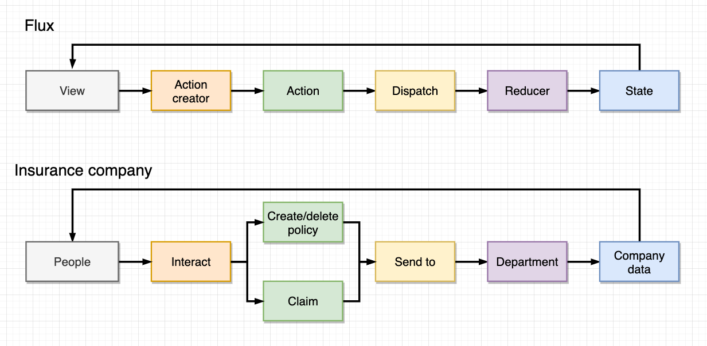

I've recently been working through a popular [React course on Udemy](https://www.udemy.com/course/react-redux/) and in this course the Flux pattern is explained using an insurance company analogy with Redux. I'm going to share this example and expand on it a little, hopefully it's useful to you.


*The Flux pattern compared to an example workflow in an insurance company*

In the above diagram you can see each element of the Flux pattern mapped to a corresponding event in an insurance company.

- View -> People
- Action creator -> Website or phone
- Action -> Create/delete policy or make a claim
- Dispatch -> Send to department
- Reducer -> Department
- State -> Company data and bank balance

People will interact with the insurance company using a website or phone to create policies, cancel policies, or make claims. This is analogous to UI components using action creators to create actions.

New policies and claims must be routed to the right departments and processed, similar to how actions are dispatched to reducers. 

And when a department has processed a new policy or claim, the company's data is modified, this could be the bank balance and/or customers on file. When reducers process actions they return a new updated version of state which becomes the current state.

## Actions

Actions are plain JavaScript objects that are returned from a function. This function is called an action creator.

```javascript
// Flux Insurance company
// 
// People (action creator) create a policy, delete a policy, or create a claim (action).
// These are sent (dispatch) to a department (reducer) for processing.
// Which will then update the company's data (state).
const CREATE_POLICY = 'CREATE_POLICY'
const DELETE_POLICY = 'DELETE_POLICY'
const CREATE_CLAIM = 'CREATE_CLAIM'

// action creators return an action
// an action is a plain JS object with a type and payload
const createPolicy = function (name, amount){
  return {
    type: CREATE_POLICY,
    payload: {
      name,
      amount
    }
  }
}

const deletePolicy = function (name){
  return {
    type: DELETE_POLICY,
    payload: {
      name
    }
  }
}

const createClaim = function (name, amount){
  return {
    type: CREATE_CLAIM,
    payload: {
      name, 
      amount
    }
  }
}
```
*Action creators create actions that can be consumed by reducers*

Action creators are functions that typically return an object with two properties, in the above example **type** and **payload**. These properties can be named anything you want as long your reducers know how to read them. The **type** differentiates one action from another, if two actions have the same type your reducers may get a little confused and start overwriting data in state. And **payload** is the data you want your reducers to process.

## Reducers

Reducers are like event listeners, they will act on certain types of events and ignore others. Reducers modify state.

```javascript
// reducers process actions and return updated state 
const claimsHistory = function(state = [], action){
  switch(action.type){
    case CREATE_CLAIM:{
      return [...state, action.payload]
    }
    default: {
      return state
    }
  }
}

const accounting = function(state = 100, action){
  switch(action.type){
    case CREATE_CLAIM:{
      return state - action.payload.amount
    }
    case CREATE_POLICY:{
      return state + action.payload.amount
    }
    default: {
      return state
    }
  }
}

const policies = function(state = [], action) {
  switch(action.type){
    case CREATE_POLICY:{
      return [...state, action.payload.name]
    } 
    case DELETE_POLICY:{
      return state.filter(name => name != action.payload.name)
    }
    default: {
      return state
    }
  }
}
```
*Company departments are similar to reducers, they process only the events they are interested in, and this modifies the company's data*

Reducers consume actions and update state, they also have access to the current state in order to create new versions. Reducers will consume only the actions they are concerned about. If a reducer is not interested in the current action that was dispatched it will return the current state without modification.

## State

State is a plain JavaScript object stored in browser memory. It is updated by reducers. 

State should be treated as immutable, when creating new versions of state you should use the spread operator `{...}` and use it at each level of an object tree to avoid copying references to the original object contents. We always want new versions of state from our reducers, no lingering references that will cause bugs later. Below is an example of creating deep copies of a JavaScript object, use this approach in your reducers to create new versions of state.

```javascript
const x = {
  a: 'test', // level 0
  b: {
    name: 'x', // level 1
    c: {
      value: 'DFV' // level 2
    }
  }
}

const y = {
  ...x, // copy level 0 properties and values
  b: { 
    ...x.b, // copy level 1 properties and values
    c: {
      ...x.b.c // copy level 2 properties and values
    }
  }
}

x.b.name = 'updated'
x.b.c.value = 'GME'

console.log(x)

{
   "a":"test",
   "b":{
      "name":"updated",
      "c":{
         "value":"GME"
      }
   }
}

console.log(y)

{
   "a":"test",
   "b":{
      "name":"x",
      "c":{
         "value":"DFV"
      }
   }
}
```
*Copying object properties and values at each level of an object tree*

We want to make copies of an objects properties at each level of the object tree. If we don't do this we can end up with references to sections of the original object tree.

```javascript
const x = {
  a: "test", // level 0
  b: { 
    name: "x", // level 1
    c: { 
      value: "dfv" // level 2
    }
  }
};

const y = {
  ...x, // copy level 0 properties and values
  b: {
    ...x.b, // copy level 1 properties and values   
  }
};

x.b.name = "updated";
x.b.c.value = "GME";

console.log(x)

{
   "a":"test",
   "b":{
      "name":"updated",
      "c":{
         "value":"GME"
      }
   }
}

console.log(y)

{
   "a":"test",
   "b":{
      "name":"x",
      "c":{ // this is a reference to x.b.c because we didn't copy level 2
         "value":"GME"
      }
   }
}
```
*Only level 0 and level 1 are copied*

You can see in the above example, if we only copy level 0 and level 1 we are left with a reference to level 2 of the original object `x`. And so when we update `x.b.c.value` both of the objects `x` and `y` are updated. Trying to track down these types of bugs can be painful so be vigilant.
## Redux

```javascript
// init Redux by combining reducers and creating the store
const {createStore, combineReducers} = Redux;

const departments = combineReducers({
  claimsHistory,
  accounting,
  policies
})

const store = createStore(departments)

// dispatch sends actions to reducers
store.dispatch(createPolicy('Alex', 20))
store.dispatch(createPolicy('Greg', 90))
store.dispatch(createPolicy('Jim', 70))

// state is modified by actions
console.log(store.getState())

// console output
{
   "claimsHistory":[
      
   ],
   "accounting":280,
   "policies":[
      "Alex",
      "Greg",
      "Jim"
   ]
}
```
*Redux is a popular implementation of the Flux pattern, it provides a store, dispatch, and routes actions to reducers*

Redux implements the Flux pattern and provides functionality to enable unidirectional data flow. Reducers are registered and ready to consume actions. Actions are created and dispatched by the Redux store. The store holds the latest version of state, and updates this state based on the individual reducer logic.

You can see from the example above our state contains "slices" based on the names of our reducers. In this way slices of state are kept isolated from each other meaning one reducer can't update the state of another. If a single action must update two different slices of state at the same time, then each reducer needs to listen out for that action **type** and process the action accordingly.

## Conclusion

In this post we looked at the Flux architecture pattern using the example of an insurance company and implemented it's data flow using Redux. I have used the Flux pattern in another side project recently to manage client-side application state for features like authentication, and it can get messy very quickly!.

In my experience reducers and state can get tricky to manage if left to evolve without design. Reducers can grow quickly during development so it's important to spend some time designing how your state should look before adding that new feature. 

And make sure your state is immutable, it can be difficult to track down a bug caused by a copied object reference instead of the intended values. 

Also try to keep your state slices small following the Separation of concerns (SoC) principle, this will reduce the complexity of your reducers and save you a lot of time in the end game. 

## Related

- [Bowhead](/blog/bowhead-react-plugin-system/)

## References

- [Flux](https://facebook.github.io/flux/docs/in-depth-overview)
- [Redux](https://redux.js.org/)
- [Separation of concerns (SoC) principle](https://en.wikipedia.org/wiki/Separation_of_concerns#:~:text=In%20computer%20science%2C%20separation%20of,section%20addresses%20a%20separate%20concern.&text=When%20concerns%20are%20well%2Dseparated,%2C%20reuse%2C%20and%20independent%20development.)
- [Modern React with Redux Udemy course](https://www.udemy.com/course/react-redux/)