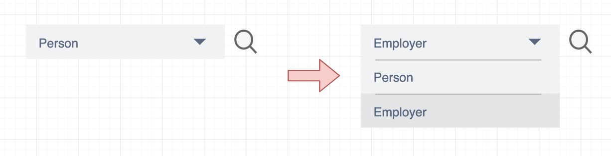
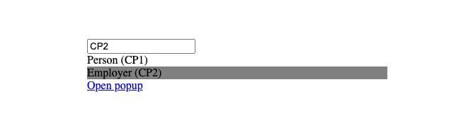

> I recently encountered a bug that showed up when checking the DOM in multiple locations for a specific element. The existing code used try/catch blocks to prevent propagating errors when DOM queries failed. The try/catch/finally combo is not exactly intuitive.

<!-- end -->

In this post I'll talk about a bug I encountered after a components HTML structure was refactored but the underlining JavaScript logic was not. The existing code used a single try/catch block to find an element in the DOM, and if not found would try an alternative location for the element being targeted. If the first query of the DOM failed the error was caught, but subsequent queries also caused errors and were not handled correctly.

## The component

The component in question is called a "multiple search page popup" which is a combination of a dropdown and a link, in this case the search icon is the link.


*Multiple search page popup component*

When the user selects an option from the dropdown and then clicks the search icon we use JavaScript to find the selected option and use it to open a specific popup page. There are as many different popup pages as there are options in the dropdown, and popup pages allow the user to search for specific information.

The bug appeared when some refactoring was done to use a "list box" component or a "select" element for the dropdown depending on some page context data. For example we went from using only a "select" element for all instances of the "multiple search page popup" component to using a "select" element or a "list box" component.

```html
<select>
  <option value="CP1">Person</option>
  <option value="CP2">Employer</option>
</select>
```
*A select element with options for the dropdown*

```html
<div id="list-box">
  <div value="CP1">Person</div>
  <div value="CP2">Employer</div>
</div>
```
*A list box component using multiple div elements as options in the dropdown*

> I'm not going to go into why this decision was made because it does not help us understand error handling in this example. But at this point you should understand that we now use two different HTML structures depending on the page context. And both versions of this component look identical to the user.

With this change in the HTML structure the JavaScript logic for finding the selected option is now fragmented, the old code searched in a single DOM location to grab the selected option from the select dropdown, but now we must search in another DOM location if it was not already found.

## The bug 🐛

I've re-created the "multiple search page popup" component HTML structure in a very basic example. This is the new version that will be used on some pages of the application, alongside the old version. And should help to illustrate the bug I encountered.

```html
<div id="container">
  <input value="CP1" />
  <div id="list-box">
    <div id="list-box-item" value="CP1">Person (CP1)</div>
    <div id="list-box-item" value="CP2">Employer (CP2)</div>
  </div>
  <a href="#" id="link">Open popup</a>
</div>
```
*New variant of the multiple search page popup component using a list box*


*Multiple search page popup component rendered in the browser*

In the above code snippet and image you can see the newest version of the "multiple search page popup" component. I've omitted some styling to hide the options `Person` and `Employer` behind a dropdown menu. And the "Open popup" link represents the search icon.

The `input` element shows the value associated with the users selection from the "dropdown", in this case the user selected `Employer` which has a value of `CP2`. Now when the "Open popup" link is clicked this value of `CP2` is used to select the popup page to be rendered.

```javascript
document.querySelectorAll("#list-box-item").forEach(function (item) {
  item.addEventListener("click", function () {
    const container = this.parentNode.parentNode;
    const hiddenInputElement = container.childNodes[1];
    hiddenInputElement.value = this.getAttribute("value");
  });
});
```

This is an example of the code used to interact with the list box component. You may have some suggestions for improvements, but for now this is what we have to work with.

```javascript
document.querySelector("#link").addEventListener("click", function () {
  let value = null;
  const container = this.parentNode;
  // find the selected option
  try {
    // location 1
    const selectElement = container.childNodes[0];
    value = selectElement.options[selectElement.selectedIndex];
  } catch (e) {
    // location 2
    const selectElement = container.childNodes[1];
    value = selectElement.options[selectElement.selectedIndex];
  }  
  console.log(value);
});
```
*Multiple search popup component logic (old)*

And this is the old JavaScript logic that closely resembles where the bug was found. It searches in two different locations expecting a `select` element in both cases. 

This code was designed to work with the original version of our "multiple search popup component" and will not search for the selected option in our new component variant that uses a "list box" component so we need to update it.

```javascript
document.querySelector("#link").addEventListener("click", function () {
  let value = null;
  const container = this.parentNode;
  // find the selected option
  try {
    // location 1
    const selectElement = container.childNodes[0];
    value = selectElement.options[selectElement.selectedIndex];
  } catch (e) {
    // location 2
    const selectElement = container.childNodes[1];
    value = selectElement.options[selectElement.selectedIndex];
  }  

  // location 3
  if (!value) {
    const hiddenInputElement = container.firstElementChild;
    value = hiddenInputElement.value;
  }
  console.log(value);
});
```
*Multiple search popup component logic (new)*

This was the first change I made and tested. We added a new location to search, `location 3`, the first child of the container. This should grab our `input` element in our "list box" component to find the selected option value if the first two searches fail.

But this code does not work, because in our `catch` block we look in `location 2` and if the element is not found an error is thrown. This stops function execution so we never get to search in our new location, `location 3`. This sent me down the try/catch/finally error handling rabbit hole.

## Error handling

Below is a series of code examples that use the `try/catch/finally` blocks to illustrate how they work and differ from one another. Understanding how they work together can be a little tricky, so if your interested take your time to understand each in turn.

The `finally` block will always run, for example:

```javascript
function run() {
  try {
    // no error
  } finally {
    console.log("this will always run");
  }
}
run();
```
*No errors are thrown, finally will run*

```javascript
function run() {
  try {
    throw new Error();
  } finally {
    console.log("this will always run");
  }
}
run();
```
*Throw an error in try, finally will run*

```javascript
function run() {
  try {
    throw new Error();
  } catch (e) {
    // no error
  } finally {
    console.log("this will always run");
  }
}
run();
```
*Throw an error in try but not in catch, finally will run*

```javascript
function run() {
  try {
    throw new Error();
  } catch (e) {
    throw new Error();
  } finally {
    console.log("this will always run");
  }
}
run();
```
*Throw an error in try and an error in catch, finally will run*

Now we know `finally` will always run even if we do not throw an error, but function execution may not always continue, for example;

```javascript
function run() {
  try {
    // no error
  } finally {
    console.log("this will always run");
  }

  console.log("this will run");
}
run();
```
*No errors are thrown, function execution continues*

```javascript
function run() {
  try {
    throw new Error();
  } finally {
    console.log("this will always run");
  }

  console.log("this will NOT run");
}
run();
```
*Throw an error in try, function execution stops*

```javascript
function run() {
  try {
    throw new Error();
  } catch (e) {
    // no error
  } finally {
    console.log("this will always run");
  }

  console.log("this will run");
}
run();
```
*Throw an error in try but not in catch, function execution continues*

```javascript
function run() {
  try {
    throw new Error();
  } catch (e) {
    throw new Error();
  } finally {
    console.log("this will always run");
  }

  console.log("this will NOT run");
}
run();
```
*Throw an error in try and in catch, function execution stops*

So function execution will continue only if there are no errors, or if we have a `catch` block that does not throw any errors. 

## The solution

If we take this learning now, and apply it to our bug described above in the "multiple search page popup" component, we can implement a very basic solution. This solution will search across different DOM locations and HTML structures until we find our selected option.

```javascript
document.querySelector("#link").addEventListener("click", function () {
  let value = null;
  const container = this.parentNode;
  // find the selected option
  try {
    // location 1
    if (!value) {
      const selectElement = container.childNodes[0];
      value = selectElement.options[selectElement.selectedIndex];
    }
  } catch (e) {
    // do nothing
  }

  try {
    // location 2
    if (!value) {
      const selectElement = container.childNodes[1];
      value = selectElement.options[selectElement.selectedIndex];
    }
  } catch (e) {
    // do nothing
  }

  try {
    // location 3
    if (!value) {
      const hiddenInputElement = container.firstElementChild;
      value = hiddenInputElement.value;
    }
  } catch (e) {
    // do nothing
  }

  console.log(value);
});

```
*Each time we query the DOM we do it inside of a try/catch block*

In the above code snippet we look for a "select" element in our containers child nodes collection at index `0` and `1`. Failing this we then grab the first child element of the container and extract it's value. This covers all known variants of our "multiple search page popup" component, using both the "select" element and a "list box" component.

Remember in the first version of this component a "select" element is used to implement the dropdown. With a "select" element we can query the elements `options` attribute and grab the entry at the selected index.

But in our new version of the component a "list box" component uses a bunch of `div` elements with an `input` element used to hold the selected options value.

## Conclusion

In this post I talked about a bug in a component I encountered recently that made me think a little harder about how the try/catch/finally blocks worked. At first I misunderstood when a functions execution would continue under certain error conditions, but as I explored a little deeper things became more clear.

When you need to query the DOM in multiple locations within a single function call then maybe the solution presented here is "good enough". But I'm sure there are better ways to handle this type of scenario. I would have preferred to isolate the logic for each variant of the "multiple search page popup" component to avoid having one function check multiple use cases, but there was potential here to impact the wider system so it was avoided. 

Working on this bug has reminded me that having a comprehensive set of unit and integration tests ensuring system stability as you refactor code is extremely valuable. Tests give you confidence that your changes are not negatively impacting the wider system, but only if you have quality tests. Badly written tests can give developers false positives, but I think some bad tests are still better than no tests at all. 

So write some tests! if not for you, then do it for future you, or me.

## References

- [MDN try...catch](https://developer.mozilla.org/en-US/docs/Web/JavaScript/Reference/Statements/try...catch)