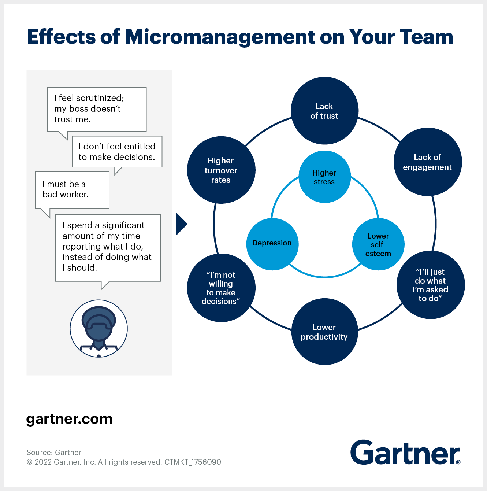

Gartner published a [report in 2022 about remote work, micromanagment, and how to fix your approach](https://www.gartner.com/en/articles/micromanaging-your-remote-workers-own-it-then-fix-it?utm_medium=social&utm_source=linkedin&utm_campaign=SM_GB_YOY_GTR_SOC_SF1_SM-SWG&utm_content=&sf260479670=1). In this post I'm going to review the report, share my experiences, and provide a summary for myself for future reference.

## 5 questions to determine if you are a micromanager
Not sure whether you’re prone to micromanaging in the world of remote work? Ask yourself these questions:

- Do I often have concerns about or question (outspokenly or silently) employees’ productivity?
- Do I find myself constantly wanting to be informed of every bit of progress made?
- Do I peek into systems records to check that someone actually did what I asked?
- Do I find myself limiting others’ authority to keep myself engaged with initiatives?
- Do I find it difficult to delegate tasks because I don’t trust they will get done?

If you answered yes to any of these questions, then you’re likely a micromanager. 

## How to fix your approach to manangement

The following are recommendations by Gartner on how to fix your approach to manangement if you are a micromanager. I've expanded on what I think should be done in each case to "action" the recommendation.

- Empower team members. Make sure team members all understand the impact and scope of what is expected of them, articulate how their activities are crucial to meeting enterprise goals and provide each with the resources they need to get the job done
  - Sprint goals provide a team target to aim for and a plan for the sprint demo at the end
  - Work with the product owner/manager to create a clear vision of the product the team is building and a detailed roadmap of how we get there
  - Share Scrum Master and Tech Lead roles. Roles are a list of responsibilities, responsibilities can be shared, and they can be used to provide mentoring and learning opportunties for the whole team. Roles do NOT provide additional authority
- Focus on outcomes. Don’t waste time obsessing over the time the team dedicates to getting the job done or how they do it. What matters is that they get results in the agreed-upon time frame
  - Sprint demos allow teams to show what they have worked on. Product Manager/Project Manager/Scrum Master/Tech Lead/etc should NOT be the one to give the demo unless they actually worked on building it, let whoever brought it to life be the one to share it
  - Measuring an individual's productivity is not important, people have busy and stressful lives. How quickly one person can learn and apply their skills is different to another. The team should be supporting it's members, not criticising or comparing them. This only creates a stressful environment
  - Standups are for requesting support, not for tracking producitivity. Everyone on the team is busy, do not waste time telling everyone how busy you are. If someone needs help the standup is the perfect time to ask for help
- Be flexible. Give people the opportunity to work when, where, and how they can be most creative and productive
  - Flexible working hours allow people to handle personal committments when it suits them best. This is crucially important for a well functioning, and happy team
  - Allow personal days to recharge, additional to PTO. As a manager you should be telling people to take personal days if needed, remind the team that they can take these days without it affecting their existing legally entitled PTO. It's easy for team members to feel like they can't take these days without consequence, be a good manager, remind the team often
- Plan for the worst case. This makes people feel trusted and confident in their ability to handle problems
  - When estimating work to fit in a sprint use the worst case estimate. If work turns out to be easier than expected its a win and will keep stress levels low. If the work turns out to take longer than expected then we get better at estimating and next time it'll be more accurate. Do not put pressure on your team, or individuals, humans don't work well under stress
- Do not blame. Blame instantly crushes self-esteem and spoils the bonds of trust with your employees. Focus on lessons learned from failures. Let your team come up with the answer of what to do better next time
  - Win as a team, lose as a team. When you reward individuals for the work of the entire team you severly damage team morale and trust. Damaging team morale is costly to an organisation, people will leave, or they will "silently leave" which means they will do the bare minimum to get by instead of working for themselves and the fun of it
  - Do not escalate internal team issues without first discussing with specific team members. Encourage the team to talk to each other about issues, do not entertain personal opinions, and demand data for accusations. When you regurgitate opinions you look foolish, and you damage trust 

In summary, managers and tech leads should unblock the team, not get in there way. Trust the team of professionals to know how to do their jobs in the best way for them. Set clear targets, try not to be condescending. And tell your team to take some personal time every now and again, they need it.

## A note on leadership

Leadership is hard to define, but you know a leader when you meet one. They are approachable, empathetic, modest, and humble. 

A "title" does not make you a leader and sometimes company titles such as "Director", "Senior Manager", "Senior Engineer", or "Tech Lead" give people a sense of superiority and smugness to the point where they consider themselves leaders. These company titles assign a collection of responsibilties to an individual and usually as your level of responsibility increases so does your compensation. You don't automatically become a leader when one of these roles are assigned to you. 

I've known some amazing leaders in my career, of varying titles. And I've encountered some people who are not leaders, of varying titles. 

In my experience leaders are:
- Invovled in defining the **vision** and the **roadmap**
  - Discovery (what should we do?) and feasibility (is it possible?) are the primary problems to solve here. Good leaders get stuck in and do the grunt work
- Focused on **unblocking** the team
  - The primary responsibility of a leader is to remove obstacles that block the team as they make their way towards the **vision** using the **roadmap**. They change the teams environment from "hiking uphill" to "jogging downhill"
- Honest about their skill level in a particular context and are open to learning
- Leaders DO NOT need the highest skill level on the team
  - Being the best is not an attribute of a leader
- Great leaders are modest and humble, they don't question your methods but try to understand them and fill any gaps. They use **how** instead of **why**, e.g. 
  - **Why** have you not incorporated our security guidelines into your work? // bad
  - **How** have you incorporated our security guidelines into your work? // good
- NOT required to speak in every meeting
  - Leaders are not always first to speak, they don't speak for prolonged periods of time, they don't repeat others while slightly changing the language used, or use terms like "Great job, well done!"

## References

- [Gartner.com: Micromanaging Your Remote Workers? Own It, Then Fix It.](https://www.gartner.com/en/articles/micromanaging-your-remote-workers-own-it-then-fix-it?utm_medium=social&utm_source=linkedin&utm_campaign=SM_GB_YOY_GTR_SOC_SF1_SM-SWG&utm_content=&sf260479670=1)