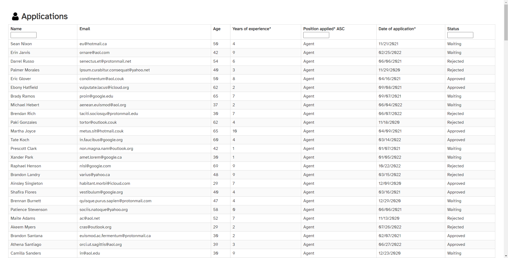

A table written in JavaScript using React that has filtering, sorting, and URL syncing features

GitHub https://github.com/uxdxdev/vite-react-table-sort-filter-url  
Demo https://uxdx.dev/vite-react-table-sort-filter-url
