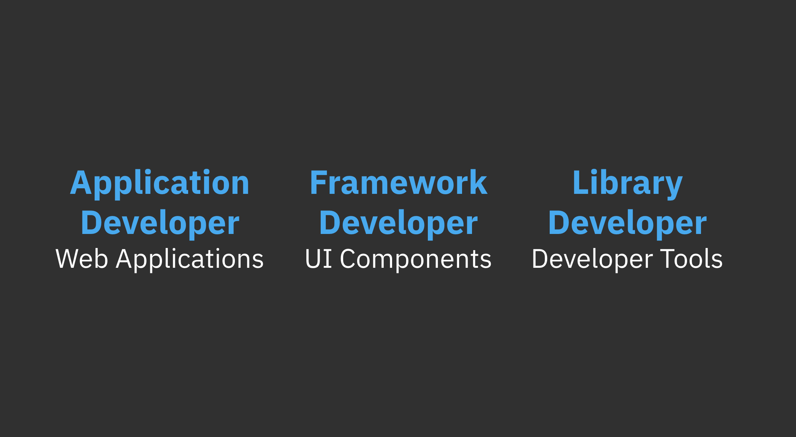
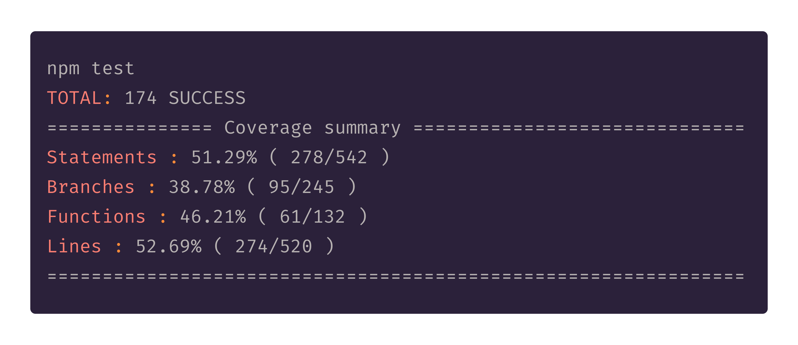

> DX is the user experience from a developers perspective when using a product or service such as client libraries, APIs, SDKs, frameworks, or other developer tools.

I'm sure you've heard of UX (User Experience) and from what I have seen and read online it mostly relates to the user experience of end-users when using a product or service.

**But what about the developers building those products and services?**

In this post I'm going to talk about the UX from a developers perspective when using software libraries, UI components, and other developer tools. I'll cover different developers types with some good and bad examples of DX. And I've listed Jakob Nielson's 10 usability heuristics below because I believe they can be used alot more to improve DX.

Developers may also interact with APIs and documentation heavily which is extremely important when designing a good user experience for developers. I will not go into API design and documentation in this post.

## Developer Types



As an example, I've highlighted three different types of developers, application developers, framework developers, and library developers. Each type of developer might have specific tools that they use as they work. This is not an exhaustive list of developer types, I'm using these to talk about some good and bad scenarios that might occur.

Let's say that an application developer uses UI components to build web applications, framework developers use testing libraries while building UI components, and library developers use command line tools to build testing libraries. Each of these developers will experience a variety of pain points.

## Bad DX / Good DX

So what's the difference between a good developer experience and a bad developer experience? These examples are contrived.

**Bad DX for an application developer**

```javascript
<Panel isNotBordered={true}>
  // confusing alignment props
  <PanelTitle isNotAlignedToSide="right">"Panel Title"</PanelTitle>
  // default pink background & not visible
  <PanelContent showPinkBackgroud={false} isNotVisible={false}>
    "This is the panel content."
  </PanelContent>
</Panel>
```

This is an example of a bad user experience for an application developer. The UI components they have to use to build their web application have badly defined props and terrible defaults. Using components like these would be very hard to reason about and maintain.

**Good DX for an application developer**

```javascript
// easy to use props
<Panel bordered={true} titleCentered={true} title="Panel Title">
  // sensible defaults
  <PanelContent>"This is the panel content."</PanelContent>
</Panel>
```

This example is a better user experience for an application developer. The UI components have clear well defined props and sensible defaults. I think developers would prefer to use and maintain this type of UI component.

**Bad DX for a framework developer**

```javascript
// bad function naming
test1st('verifies that the panel class is set to the root element', () => {
  const panel = createFakeComponentWithSomeExtraStuffToMakeItWork(
    <Panel>
      <PanelBody>"Panel content"</PanelBody>
    </Panel>
  )
  // multiple stages to get component ready for testing
  const componentReadyForTesting = prepItemForTest(panel)

  expectToFindDiv3(
    componentReadyForTesting.find('div').first().hasClass('root')
  ).toBeTruthy()
})
```

In this example a framework developer is building some UI components that need to be tested. The testing library they are using provides terrible function names. It also requires that the components be passed through some setup steps, and finally the expectation functions are not great.

**Good DX for a framework developer**

```javascript
test('verifies that the panel class is set to the root element', () => {
  const panel = mount(
    <Panel>
      <PanelBody>"Panel content"</PanelBody>
    </Panel>
  )
  expect(panel.find('div').first().hasClass('root')).toBeTruthy()
})
```

Compared to the example above this testing library provides a much better UX for a developer. Easy to understand testing function with minimal steps. The expectation is straight forward and generic enough to be used in many different context.

**Bad DX for a library developer**


A developer building a library wants to run some tests on the command line. They run `npm test` and see this output. No feedback to the developer that tests are running, no indication of the number of tests being run, or if any have passed or failed. This would be a bad user experience for a developer.

**Good DX for a library developer**



Now compare this console output to the bad DX above. A developer runs the tests, and the result shows the number of tests and a coverage summary. Of coarse this could be improved but it is a much better user experience for the developer.

The examples here highlight the differences in user experience from a developers perspective in a few scenarios. This is very different to the UX that an end-user would have using a web application or website. Developers may also interact heavily with documentation and APIs. I'm sure you have seen some examples of bad documentation or poorly defined APIs. Thinking about how a developer interacts with your product or service is crucial to providing a good user experience.

## 10 Usability heuristics for user interface design

> Jakob Nielsen's 10 general principles for interaction design. They are called "heuristics" because they are broad rules of thumb and not specific usability guidelines. -- <cite>https://www.nngroup.com/articles/ten-usability-heuristics/</cite>

Jakob Nielsen's user interaction design heuristics can help when it comes to designing a good developer experience. Not all of the heuristics may be easily applied to UI components, library APIs, or command line output, but they could provide some guidance.

- Visibility of system status

The system should always keep users informed about what is going on, through appropriate feedback within reasonable time.

- Match between system and the real world

The system should speak the users' language, with words, phrases and concepts familiar to the user, rather than system-oriented terms. Follow real-world conventions, making information appear in a natural and logical order.

- User control and freedom

Users often choose system functions by mistake and will need a clearly marked "emergency exit" to leave the unwanted state without having to go through an extended dialogue. Support undo and redo.

- Consistency and standards

Users should not have to wonder whether different words, situations, or actions mean the same thing. Follow platform conventions.

- Error prevention

Even better than good error messages is a careful design which prevents a problem from occurring in the first place. Either eliminate error-prone conditions or check for them and present users with a confirmation option before they commit to the action.

- Recognition rather than recall

Minimize the user's memory load by making objects, actions, and options visible. The user should not have to remember information from one part of the dialogue to another. Instructions for use of the system should be visible or easily retrievable whenever appropriate.

- Flexibility and efficiency of use

Accelerators — unseen by the novice user — may often speed up the interaction for the expert user such that the system can cater to both inexperienced and experienced users. Allow users to tailor frequent actions.

- Aesthetic and minimalist design

Dialogues should not contain information which is irrelevant or rarely needed. Every extra unit of information in a dialogue competes with the relevant units of information and diminishes their relative visibility.

- Help users recognize, diagnose, and recover from errors

Error messages should be expressed in plain language (no codes), precisely indicate the problem, and constructively suggest a solution.

- Help and documentation

Even though it is better if the system can be used without documentation, it may be necessary to provide help and documentation. Any such information should be easy to search, focused on the user's task, list concrete steps to be carried out, and not be too large.

# Why improve DX?

Improving DX has a number of benefits for any product or service.

- Developers will be less stressed trying to reason about the tools they are trying to use which leads to better solutions. They will also be more productive if your documentation is easy to read and follow.
- We talk about the tools we use everyday, if your product or service provides a bad DX, our friends will hear it. Developers become advocates for your product or services when it provides a good DX.

# First steps to improving DX

Here are a few things you can focus on right now to improve the DX your creating:

- Create client libraries in multiple languages to make integration with you product or service easier for developers.
- Create documentation for getting set up, building solutions, and using client libraries. This documentation needs to be aesthetically pleasing, developers like well designed documentation.
- Provide code examples and solutions to common problems that you customers might encounter. For example, if your platform provides authentication put an example of how a developer can integrate their solution in multiple languages.
- Your API should be well designed, use industry standards, and be consistent. This enables developers to build momentum when interacting with your API.
- Create release notes and change logs for every new release. Developers like to see what has changes between versions, we're curious so help us out a bit.

## Conclusion

In this post I talked about the user experience from a developers perspective. I've highlighted three different types of developers, application developer, framework developer, and library developer. A developer could be all three types in their role as a software engineer and I've used them to categorize the examples of good and bad experiences they may encounter. I've also listed Jakob Nielson's 10 usability heuristics for interaction design at the end. I listed the benefits of improving DX and how you might do this right now for you products and services.

I believe that Jakob Neilson's heuristics are already being applied to software libraries and tools to improve the user experience for developers, but it seems that only sometimes it is a conscious effort by the creators. By following the heuristics more closely we can greatly improve the usability of the things we build. Developers may also interact heavily with APIs and documentation making them extremely important when designing good DX. You can improve DX by focusing on a few small improvements at a time. The benefits of improving your DX is worth it.

So remember if your building a product or service, devs might be users too.

# References

- 10 Usability Heuristics for User Interface Design https://www.nngroup.com/articles/ten-usability-heuristics/

Thanks for reading!.
